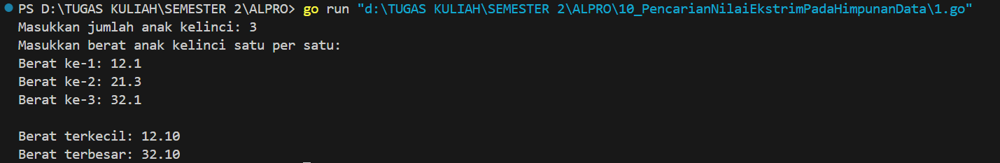
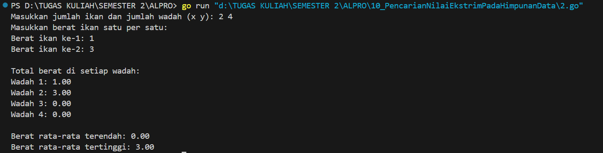
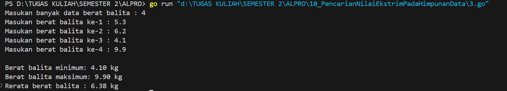

<h1 align="center">Laporan Praktikum Modul 10 <br>Pencarian Nilai Ekstrim Pada Himpunan Data</h1>
<p align="center">Azzahra Farelika Esti Ning Tyas - 103112430023</p>

## Dasar Teori

Pencarian nilai ekstrem dalam himpunan data menggunakan bahasa Go merupakan proses untuk menentukan nilai paling kecil (minimum) dan paling besar (maksimum) dari kumpulan data yang tersimpan dalam array atau slice. Proses ini dilakukan dengan membandingkan setiap elemen satu per satu. Umumnya, nilai awal yaitu elemen pertama dalam array dianggap sebagai nilai minimum dan maksimum sementara. Selanjutnya, program melakukan perulangan untuk mengecek elemen-elemen berikutnya. Jika ditemukan elemen yang lebih kecil dari nilai minimum saat ini, maka nilai tersebut menggantikan posisi minimum. Sebaliknya, jika ada elemen yang lebih besar dari maksimum saat ini, maka nilai maksimum diperbarui. 
## Unguided

#### Soal 1

> Sebuah program digunakan untuk mendata berat anak kelinci yang akan dijual ke pasar. Program ini menggunakan array dengan kapasitas 1000 untuk menampung data berat anak kelinci yang akan dijual.
> 
> Masukan terdiri dari sekumpulan bilangan, yang mana bilangan pertama adalah bilangan bulat N yang menyatakan banyaknya anak kelinci yang akan ditimbang beratnya. Selanjutnya N bilangan riil berikutnya adalah berat dari anak kelinci yang akan dijual. Keluaran terdiri dari dua buah bilangan riil yang menyatakan berat kelinci terkecil dan terbesar

```go
package main

import (
	"fmt"
)

func main() {
	var n int
	var berat [1000]float64

	fmt.Print("Masukkan jumlah anak kelinci: ")
	fmt.Scan(&n)

	if n <= 0 || n > 1000 {
		fmt.Println("Jumlah harus antara 1 sampai 1000")
		return
	}

	fmt.Println("Masukkan berat anak kelinci satu per satu:")
	for i := 0; i < n; i++ {
		fmt.Printf("Berat ke-%d: ", i+1)
		fmt.Scan(&berat[i])
	}

	terkecil := berat[0]
	terbesar := berat[0]

	for i := 1; i < n; i++ {
		if berat[i] < terkecil {
			terkecil = berat[i]
		}
		if berat[i] > terbesar {
			terbesar = berat[i]
		}
	}

	fmt.Printf("\nBerat terkecil: %.2f\n", terkecil)
	fmt.Printf("Berat terbesar: %.2f\n", terbesar)
}
```


Program tersebut berfungsi untuk mencari berat terkecil dan terbesar dari sekumpulan anak kelinci. Program diawali dengan mendeklarasikan variabel n untuk menyimpan jumlah anak kelinci dan array berat berukuran 1000 untuk menampung data beratnya. Setelah pengguna memasukkan jumlah anak kelinci, program memvalidasi agar jumlah tersebut berada dalam rentang 1 hingga 1000. Jika valid, pengguna diminta mengisi berat masing-masing anak kelinci satu per satu. Program kemudian menginisialisasi nilai terkecil dan terbesar dengan elemen pertama dari array. Selanjutnya, program melakukan iterasi untuk membandingkan setiap elemen dalam array guna menemukan nilai minimum dan maksimum. Terakhir, program menampilkan berat terkecil dan terbesar dengan format dua angka di belakang koma. Program ini mengimplementasikan konsep dasar pencarian nilai ekstrem pada himpunan data menggunakan array dan perulangan.

#### Soal 2

>Sebuah program digunakan untuk menentukan tarif ikan yang akan dijual ke pasar. Program ini menggunakan array dengan kapasitas 1000 untuk menampung data berat ikan yang akan dijual.
>
>Masukan terdiri dari dua baris, yang mana baris pertama terdiri dari dua bilangan bulat x dan y. Bilangan x menyatakan banyaknya ikan yang akan dijual, sedangkan y adalah banyaknya ikan yang akan dimasukan ke dalam wadah. Baris kedua terdiri dari sejumlah x bilangan riil yang menyatakan banyaknya ikan yang akan dijual. Keluaran terdiri dari dua baris. Baris pertama adalah kumpulan bilangan riil yang menyatakan total berat ikan di setiap wadah (jumlah wadah tergantung pada nilai x dan y, urutan ikan yang dimasukan ke dalam wadah sesuai urutan pada masukan baris ke-2). Baris kedua adalah sebuah bilangan riil yang menyatakan berat rata-rata ikan di setiap wadah.

```go
package main

import (
	"fmt"
)

func main() {
	const max = 1000
	var x, y int
	var beratIkan [max]float64

	fmt.Print("Masukkan jumlah ikan dan jumlah wadah (x y): ")
	fmt.Scan(&x, &y)

	if x <= 0 || x > max || y <= 0 || y > max {
		fmt.Println("Jumlah ikan dan wadah harus antara 1 sampai", max)
		return
	}

	fmt.Println("Masukkan berat ikan satu per satu:")
	for i := 0; i < x; i++ {
		fmt.Printf("Berat ikan ke-%d: ", i+1)
		fmt.Scan(&beratIkan[i])
	}

	wadah := make([]float64, y)

	for i := 0; i < x; i++ {
		wadah[i%y] += beratIkan[i]
	}

	fmt.Println("\nTotal berat di setiap wadah:")
	for i := 0; i < y; i++ {
		fmt.Printf("Wadah %d: %.2f\n", i+1, wadah[i])
	}

	minRata := wadah[0]
	maxRata := wadah[0]

	for i := 1; i < y; i++ {
		if wadah[i] < minRata {
			minRata = wadah[i]
		}
		if wadah[i] > maxRata {
			maxRata = wadah[i]
		}
	}

	fmt.Printf("\nBerat rata-rata terendah: %.2f\n", minRata)
	fmt.Printf("Berat rata-rata tertinggi: %.2f\n", maxRata)
}
```


Program tersebut berfungsi untuk mendistribusikan berat ikan ke sejumlah wadah dan menghitung total berat di tiap wadah. Pengguna memasukkan jumlah ikan (x) dan jumlah wadah (y), lalu berat masing-masing ikan. Program menggunakan operasi modulus (i % y) untuk mendistribusikan ikan secara merata ke wadah. Setelah itu, program mencetak total berat tiap wadah dan mencari berat total minimum dan maksimum di antara semua wadah. Program ini menunjukkan penggunaan array, slice, perulangan, serta pencarian nilai ekstrem dalam data.
#### Soal 3

>Pos Pelayanan Terpadu (posyandu) sebagai tempat pelayanan kesehatan perlu mencatat data berat balita (dalam kg). Petugas akan memasukkan data tersebut ke dalam array. Dari data yang diperoleh akan dicari berat balita terkecil, terbesar, dan reratanya.

```go
package main

import (
	"fmt"
)

type arrBalita [100]float64

func hitungMinMax(arr arrBalita, n int, bMin, bMax *float64) {
	if n == 0 {
		fmt.Println("Data kosong.")
		return
	}
	*bMin = arr[0]
	*bMax = arr[0]
	for i := 1; i < n; i++ {
		if arr[i] < *bMin {
			*bMin = arr[i]
		}
		if arr[i] > *bMax {
			*bMax = arr[i]
		}
	}
}

func hitungRerata(arr arrBalita, n int) float64 {
	var total float64 = 0
	for i := 0; i < n; i++ {
		total += arr[i]
	}
	return total / float64(n)
}

func main() {
	var data arrBalita
	var n int

	fmt.Print("Masukan banyak data berat balita : ")
	fmt.Scan(&n)

	for i := 0; i < n; i++ {
		fmt.Printf("Masukan berat balita ke-%d : ", i+1)
		fmt.Scan(&data[i])
	}

	var min, max float64
	hitungMinMax(data, n, &min, &max)
	rerata := hitungRerata(data, n)

	fmt.Printf("\nBerat balita minimum: %.2f kg\n", min)
	fmt.Printf("Berat balita maksimum: %.2f kg\n", max)
	fmt.Printf("Rerata berat balita : %.2f kg\n", rerata)
}
```


Program tersebut berfungsi untuk mengolah data berat balita, yaitu menghitung berat minimum, maksimum, dan rata-rata dari sejumlah data yang dimasukkan. Program menggunakan tipe data khusus arrBalita berupa array berdimensi 100 untuk menyimpan data berat. Fungsi hitungMinMax digunakan untuk mencari nilai minimum dan maksimum dengan memanfaatkan pointer agar hasilnya bisa dikembalikan ke fungsi main. Fungsi hitungRerata menjumlahkan seluruh data berat dan membaginya dengan jumlah data untuk mendapatkan rata-rata. Di fungsi main, program meminta jumlah data (n) dan berat balita satu per satu, lalu memanggil kedua fungsi untuk menampilkan berat terkecil, terbesar, dan rata-ratanya. Program ini mempraktikkan penggunaan array, fungsi, dan pointer untuk pengolahan data numerik.