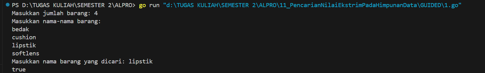
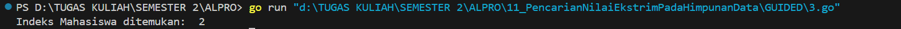
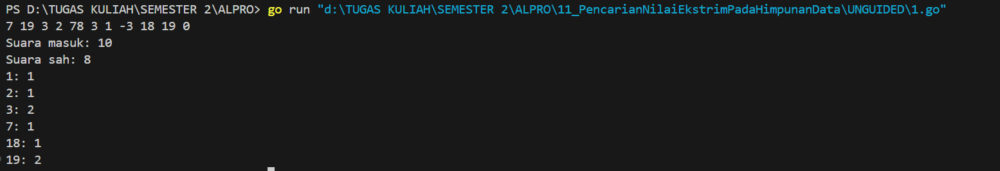
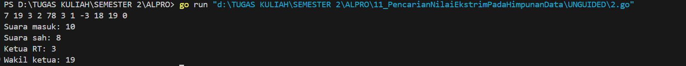
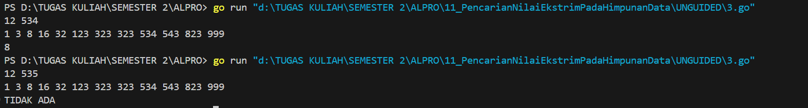

<h1 align="center">Laporan Praktikum Modul 11 <br>Pencarian Nilai Acak Pada Himpunan Data</h1>
<p align="center">Azzahra Farelika Esti Ning Tyas - 103112430023</p>

## Dasar Teori

Pencarian nilai acak dalam data melibatkan dua metode utama: Sequential Search dan Binary Search. Sequential Search mencari elemen dengan memeriksa satu per satu, cocok untuk data yang tidak terurut. Sedangkan Binary Search lebih efisien untuk data yang sudah terurut, dengan membagi data dan memeriksa elemen tengah secara bertahap. Kedua metode ini bisa diterapkan pada array bertipe dasar maupun struct, tergantung field pencariannya.
## Guided

#### Soal 1

```go
package main

import "fmt"

func cariBarang(daftar []string, x string) bool {
    for _, barang := range daftar {
        if barang == x {
            return true
        }
    }
    return false
}

func main() {
    var n int
    fmt.Print("Masukkan jumlah barang: ")
    fmt.Scan(&n)

    daftarBarang := make([]string, n)
    fmt.Println("Masukkan nama-nama barang:")
    for i := 0; i < n; i++ {
        fmt.Scan(&daftarBarang[i])
    }

    var barangDicari string
    fmt.Print("Masukkan nama barang yang dicari: ")
    fmt.Scan(&barangDicari)

    ditemukan := cariBarang(daftarBarang, barangDicari)
    fmt.Println(ditemukan)
}
```


Program tersebut berfungsi untuk mencari sebuah barang dalam daftar yang dimasukkan pengguna. Pengguna memasukkan jumlah dan nama-nama barang, lalu mengetik nama barang yang ingin dicari. Fungsi cariBarang memeriksa setiap elemen dalam slice, dan mengembalikan true jika barang ditemukan, atau false jika tidak. Hasilnya ditampilkan di layar.

#### Soal 2

```go
package main

import "fmt"

func seqSearch(kalimat string, karakter byte) []int {
	var posisi []int
	for i := 0; i < len(kalimat); i++ {
		if kalimat[i] == karakter {
			posisi = append(posisi, i)
		}
	}
	return posisi
}

func main() {
	var kalimat string
	var karakter rune

	kalimat = "algoritma pemrograman"
	karakter = 'a'
	posisi := seqSearch(kalimat, byte(karakter))

	if len(posisi) > 0 {
		fmt.Print("Karakter ditemukan pada indeks: ")
		for i := 0; i < len(posisi); i++ {
			fmt.Print(posisi[i])
			if i != len(posisi)-1 {
				fmt.Print(", ")
			}
		}
	} else {
		fmt.Println("Karakter tidak ditemukan.")
	}
}
```


Program tersebut berfungsi untuk melakukan pencarian semua posisi kemunculan suatu karakter dalam sebuah string menggunakan algoritma sequential search (pencarian berurutan). Fungsi seqSearch menerima dua argumen: sebuah string (kalimat) dan sebuah karakter (karakter) dalam bentuk byte. Fungsi ini melakukan iterasi pada setiap karakter dalam string dan memeriksa apakah karakter pada indeks tersebut sama dengan karakter yang dicari. Jika sama, indeks tersebut ditambahkan ke slice posisi. 
Di fungsi main, string "algoritma pemrograman" disimpan dalam variabel kalimat, dan karakter 'a' disimpan dalam variabel karakter. Karena fungsi seqSearch membutuhkan parameter kedua dalam bentuk byte, karakter rune tersebut dikonversi ke byte saat dipanggil. Hasil dari seqSearch disimpan dalam variabel posis. Jika slice posisi tidak kosong, artinya karakter ditemukan, dan program akan mencetak indeks-indeks kemunculannya. Jika tidak ditemukan, maka akan dicetak pesan bahwa karakter tidak ditemukan.
#### Soal 3

```go
package main

import "fmt"

type Mahasiswa struct {
	NIM  string
	Nama string
}

func binarySearch(mahasiswa []Mahasiswa, target string) int {
	left := 0
	right := len(mahasiswa) - 1

	for left <= right {
		mid := left + (right-left)/2
		if mahasiswa[mid].NIM == target {
			return mid
		}

		if mahasiswa[mid].NIM > target {
			right = mid - 1
		} else {
			left = mid + 1
		}
	}
	return -1
}

func main() {
	mahasiswa := []Mahasiswa{
		{Nama: "Andi", NIM: "220001"},
		{Nama: "Budi", NIM: "220002"},
		{Nama: "Citra", NIM: "220003"},
		{Nama: "Dina", NIM: "220004"},
	}

	x := "220003" 

	index := binarySearch(mahasiswa, x)

	if index != -1 {
		fmt.Println("Indeks Mahasiswa ditemukan: ",index)
	} else {
		fmt.Println("NIM tidak ditemukan.")
	}
}
```


Program tersebut berfungsi untuk mencari data mahasiswa berdasarkan NIM. Pertama, didefinisikan sebuah struktur Mahasiswa yang memiliki dua atribut, yaitu NIM dan Nama. Fungsi binarySearch menerima slice berisi data mahasiswa yang sudah terurut berdasarkan NIM, dan sebuah nilai target yang ingin dicari. Proses pencarian dilakukan dengan membandingkan NIM di tengah-tengah slice dengan target; jika cocok, maka indeks dikembalikan. Jika NIM lebih besar dari target, pencarian dilanjutkan ke bagian kiri, dan sebaliknya jika lebih kecil. Jika tidak ditemukan, fungsi mengembalikan -1. Di fungsi main, dibuat slice mahasiswa yang sudah terurut, lalu dilakukan pencarian NIM "22000A3". Jika ditemukan, program mencetak indeks mahasiswa tersebut, jika tidak, maka muncul pesan bahwa NIM tidak ditemukan.


## Unguided

#### Soal 1

> Pada pemilihan ketua RT yang baru saja berlangsung, terdapat 20 calon ketua yang bertanding memperebutkan suara warga. Perhitungan suara dapat segera dilakukan karena warga cukup mengisi formulir dengan nomor dari calon ketua RT yang dipilihnya. Seperti biasa, selalu ada pengisian yang tidak tepat atau dengan nomor pilihan di luar yang tersedia, sehingga data juga harus divalidasi. Tugas Anda untuk membuat program mencari siapa yang memenangkan pemilihan ketua RT. Buatlah program pilkart yang akan membaca, memvalidasi, dan menghitung suara yang diberikan dalam pemilihan ketua RT tersebut.
> 
> Masukan hanya satu baris data saja, berisi bilangan bulat valid yang kadang tersisipi dengan data tidak valid. Data valid adalah integer dengan nilai di antara 1 s.d. 20 (inklusif). Data berakhir jika ditemukan sebuah bilangan dengan nilai 0. 
> 
> Keluaran dimulai dengan baris berisi jumlah data suara yang terbaca, diikuti baris yang berisi berapa banyak suara yang valid. Kemudian sejumlah baris yang mencetak data para calon apa saja yang mendapatkan suara.

```go
package main

import "fmt"

func main() {
	var input int
	totalSuara := 0
	suaraSah := 0
	suara := [21]int{}

	for {
		fmt.Scan(&input)
		if input == 0 {
			break
		}
		totalSuara++
		if input >= 1 && input <= 20 {
			suara[input]++
			suaraSah++
		}
	}

	fmt.Printf("Suara masuk: %d\n", totalSuara)
	fmt.Printf("Suara sah: %d\n", suaraSah)
	for i := 1; i <= 20; i++ {
		if suara[i] > 0 {
			fmt.Printf("%d: %d\n", i, suara[i])
		}
	}
}
```


Program tersebut berfungsi untuk menghitung jumlah total suara dan suara sah dalam sebuah pemilihan. Program menerima input suara satu per satu hingga pengguna memasukkan angka 0. Suara yang valid (antara 1 hingga 20) dihitung sebagai suara sah dan disimpan dalam array. Setelah input selesai, program menampilkan jumlah total suara, suara sah, dan rekap suara sah untuk setiap pilihan yang dipilih.

#### Soal 2

> Berdasarkan program sebelumnya, buat program pilkart yang mencari siapa pemenang pemilihan ketua RT. Sekaligus juga ditentukan bahwa wakil ketua RT adalah calon yang mendapatkan suara terbanyak kedua. Jika beberapa calon mendapatkan suara terbanyak yang sama, ketua terpilih adalah dengan nomor peserta yang paling kecil dan wakilnya dengan nomor peserta terkecil berikutnya.
> 
> Masukan hanya satu baris data saja, berisi bilangan bulat valid yang kadang tersisipi dengan data tidak valid. Data valid adalah bilangan bulat dengan nilai di antara 1 s.d. 20 (inklusif). Data berakhir jika ditemukan sebuah bilangan dengan nilai 0. 
> 
> Keluaran dimulai dengan baris berisi jumlah data suara yang terbaca, diikuti baris yang berisi berapa banyak suara yang valid. Kemudian tercetak calon nomor berapa saja yang menjadi pasangan ketua RT dan wakil ketua RT yang baru.

```go
package main

import "fmt"

func main() {
	var inputSuara, totalSuara, suaraSah int
	dataSuara := make([]int, 21)

	for {
		fmt.Scan(&inputSuara)
		if inputSuara == 0 {
			break
		}
		totalSuara++
		if inputSuara >= 1 && inputSuara <= 20 {
			dataSuara[inputSuara]++
			suaraSah++
		}
	}

	ketuaTerpilih := 0
	wakilTerpilih := 0

	for calon := 1; calon <= 20; calon++ {
		if dataSuara[calon] > dataSuara[ketuaTerpilih] || (dataSuara[calon] == dataSuara[ketuaTerpilih] && calon < ketuaTerpilih) {
			wakilTerpilih = ketuaTerpilih
			ketuaTerpilih = calon
		} else if (dataSuara[calon] > dataSuara[wakilTerpilih] || (dataSuara[calon] == dataSuara[wakilTerpilih] && calon < wakilTerpilih)) && calon != ketuaTerpilih {
			wakilTerpilih = calon
		}
	}

	fmt.Printf("Suara masuk: %d\n", totalSuara)
	fmt.Printf("Suara sah: %d\n", suaraSah)
	if suaraSah == 0 {
		fmt.Println("Tidak ada suara sah.")
	} else {
		fmt.Printf("Ketua RT: %d\n", ketuaTerpilih)
		if dataSuara[wakilTerpilih] > 0 {
			fmt.Printf("Wakil ketua: %d\n", wakilTerpilih)
		} else {
			fmt.Println("Wakil ketua: tidak ada.")
		}
	}
}
```


Program tersebut berfungsi untuk menghitung total suara, suara sah, serta menentukan ketua dan wakil ketua dari pemilihan. Program menerima input suara hingga angka 0, menghitung suara sah yang valid (1-20), dan menyimpannya dalam array. Setelah itu, program menentukan ketua dengan suara terbanyak dan wakil ketua dengan suara terbanyak kedua. Hasilnya, yaitu jumlah total suara, suara sah, ketua, dan wakil ketua (jika ada), ditampilkan di layar. Jika tidak ada suara sah, program akan menampilkan pesan bahwa tidak ada suara sah.

#### Soal 3

> Diberikan n data integer positif dalam keadaan terurut membesar dan sebuah integer lain k, apakah bilangan k tersebut ada dalam daftar bilangan yang diberikan? Jika ya, berikan indeksnya, jika tidak sebutkan "TIDAK ADA".
> 
> Masukan terdiri dari dua baris. Baris pertama berisi dua buah integer positif, yaitu n dan k. n menyatakan banyaknya data, dimana 1 < n <= 1000000. k adalah bilangan yang ingin dicari. Baris kedua berisi n buah data integer positif yang sudah terurut membesar. 
> 
> Keluaran terdiri dari satu baris saja, yaitu sebuah bilangan yang menyatakan posisi data yang dicari (k) dalam kumpulan data yang diberikan. Posisi data dihitung dimulai dari angka 0. Atau memberikan keluaran "TIDAK ADA" jika data k tersebut tidak ditemukan dalam kumpulan.

```go
package main

import "fmt"

func cariDenganBiner(data []int, pencarian int) int {
    awal := 0
    akhir := len(data) - 1
    for awal <= akhir {
        tengah := (awal + akhir) / 2
        if data[tengah] == pencarian {
            return tengah
        } else if data[tengah] < pencarian {
            awal = tengah + 1
        } else {
            akhir = tengah - 1
        }
    }
    return -1
}

func main() {
    var jumlahElemen, nilaiDicari int
    fmt.Scan(&jumlahElemen, &nilaiDicari)
    deretan := make([]int, jumlahElemen)
    for i := 0; i < jumlahElemen; i++ {
        fmt.Scan(&deretan[i])
    }
    hasil := cariDenganBiner(deretan, nilaiDicari)
    if hasil != -1 {
        fmt.Println(hasil)
    } else {
        fmt.Println("TIDAK ADA")
    }
}
```


Program tersebut berfungsi untuk pencarian biner di dalam sebuah slice data yang telah diurutkan. Program dimulai dengan meminta input dari pengguna untuk jumlah elemen dan nilai yang dicari. Selanjutnya, program menerima input nilai elemen-elemen data yang disimpan dalam slice. Fungsi cariDenganBiner digunakan untuk mencari elemen yang dicari dalam slice dengan menggunakan algoritma pencarian biner. Pencarian biner bekerja dengan membagi data menjadi dua bagian secara berulang hingga menemukan elemen yang dicari, atau menentukan bahwa elemen tersebut tidak ada. Jika nilai yang dicari ditemukan, program akan mencetak indeksnya; jika tidak, program akan menampilkan pesan "TIDAK ADA".