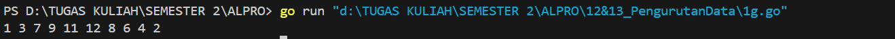
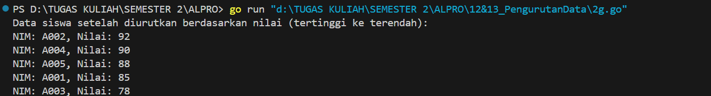
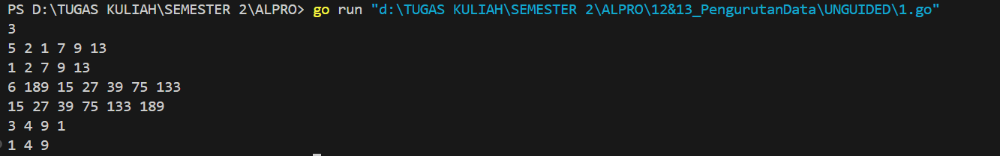
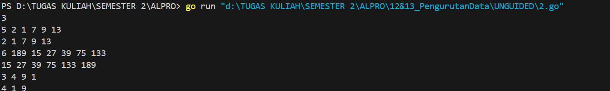
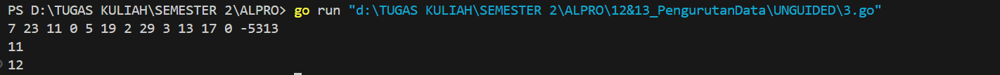
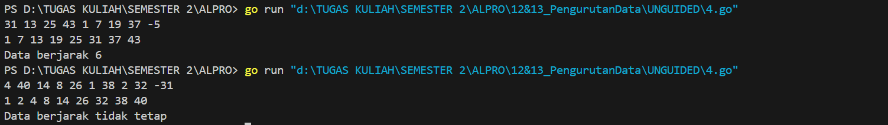
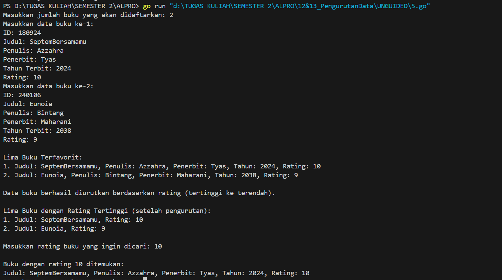

<h1 align="center">Laporan Praktikum Modul 12 & 13<br>Pengurutan Data</h1>
<p align="center">Azzahra Farelika Esti Ning Tyas - 103112430023</p>

## Dasar Teori

Pengurutan data adalah proses mengatur data (misalnya angka atau kata) dari urutan terkecil ke terbesar (ascending) atau sebaliknya (descending).  
Contoh metode pengurutan:  
1. Selection Sort: Mencari nilai terkecil/terbesar dari data yang belum terurut, lalu menukarnya ke posisi yang benar.  
2. Insertion Sort: Menyusun data satu per satu dengan membandingkan dan memasukkannya ke posisi yang tepat, seperti mengurutkan kartu di tangan.

Singkatnya adalah untuk mengatur data agar rapi sesuai urutan yang diinginkan.
## Guided

#### Soal 1

> Diberikan n bilangan bulat positif. Buat program untuk mengurutkan angka ganjil secara membesar (ascending) dan angka genap secara mengecil (descending), lalu gabungkan hasilnya dengan ganjil duluan.

```go
package main

import "fmt"

func selectionSortAsc(arr []int, panjang int) {
	var temp, i, j, idxMin int
	for i = 0; i < panjang-1; i++ {
		idxMin = i
		for j = i + 1; j < panjang; j++ {
			if arr[j] < arr[idxMin] {
				idxMin = j
			}
		}
		temp = arr[idxMin]
		arr[idxMin] = arr[i]
		arr[i] = temp
	}
}

func selectionSortDesc(arr []int, panjang int) {
	var temp, i, j, idxMax int
	for i = 0; i < panjang-1; i++ {
		idxMax = i
		for j = i + 1; j < panjang; j++ {
			if arr[j] > arr[idxMax] {
				idxMax = j
			}
		}
		temp = arr[idxMax]
		arr[idxMax] = arr[i]
		arr[i] = temp
	}
}

func main() {
	n := 10
	numbers := []int{12, 7, 3, 2, 9, 6, 8, 1, 11, 4}

	var ganjil []int
	var genap []int

	for i := 0; i < n; i++ {
		if numbers[i]%2 == 1 {
			ganjil = append(ganjil, numbers[i])
		} else {
			genap = append(genap, numbers[i])
		}
	}

	selectionSortAsc(ganjil, len(ganjil))
	selectionSortDesc(genap, len(genap))

	for i := 0; i < len(ganjil); i++ {
		fmt.Print(ganjil[i], " ")
	}
	for i := 0; i < len(genap); i++ {
		fmt.Print(genap[i], " ")
	}
}
```


Program Go ini membaca sebuah array berisi 10 angka, lalu memisahkannya menjadi dua slice: bilangan ganjil dan genap. Bilangan ganjil diurutkan secara menaik menggunakan fungsi selectionSortAsc, sedangkan bilangan genap diurutkan secara menurun menggunakan fungsi selectionSortDesc, keduanya memakai algoritma selection sort. Sorting dilakukan dengan mencari indeks minimum atau maksimum dan menukar elemen. Setelah proses pengurutan selesai, kedua slice dicetak berurutan dalam satu baris tanpa pemisah baris atau keterangan tambahan.

#### Soal 2

> Sebuah kelas memiliki sejumlah siswa yang telah mengikuti ujian. Tugas Anda adalah membuat program yang membaca nilai-nilai ujian siswa dengan struct berisikan nim dan nilai, lalu mengurutkannya dari yang tertinggi ke yang terendah menggunakan insertion sort.

```go
package main

import "fmt"

type Siswa struct {
	NIM   string
	Nilai int
}

func insertionSort(data []Siswa) {
	for i := 1; i < len(data); i++ {
		key := data[i]
		j := i - 1

		for j >= 0 && data[j].Nilai < key.Nilai {
			data[j+1] = data[j]
			j--
		}
		data[j+1] = key
	}
}

func main() {
	siswa := []Siswa{
		{"A001", 85},
		{"A002", 92},
		{"A003", 78},
		{"A004", 90},
		{"A005", 88},
	}

	insertionSort(siswa)

	fmt.Println("Data siswa setelah diurutkan berdasarkan nilai (tertinggi ke terendah):")
	for _, s := range siswa {
		fmt.Printf("NIM: %s, Nilai: %d\n", s.NIM, s.Nilai)
	}
}
```


Program Go ini mendefinisikan struct Siswa yang memiliki dua atribut: NIM (string) dan Nilai (integer). Fungsi insertionSort digunakan untuk mengurutkan slice data bertipe Siswa berdasarkan nilai (Nilai) secara menurun (dari nilai tertinggi ke terendah) menggunakan algoritma insertion sort. Dalam fungsi ini, elemen ke-i disisipkan ke posisi yang tepat di antara elemen sebelumnya jika nilainya lebih besar. Di fungsi main, dibuat slice berisi lima data siswa, lalu fungsi insertionSort dipanggil untuk mengurutkan data tersebut. Hasil akhirnya adalah daftar siswa yang ditampilkan di konsol dalam urutan nilai tertinggi ke terendah, lengkap dengan NIM dan nilainya.


## Unguided

###### Selection Sort
#### Soal 1

> Hercules, preman terkenal seantero ibukota, memiliki kerabat di banyak daerah. Tentunya Hercules sangat suka mengunjungi semua kerabatnya itu. Diberikan masukan nomor rumah dari semua kerabatnya di suatu daerah, buatlah program rumahkerabat yang akan menyusun nomor-nomor rumah kerabatnya secara terurut membesar menggunakan algoritma selection sort.

```go
package main

import (
	"fmt"
)

func selectionSort(arr []int) {
	n := len(arr)
	for i := 0; i < n-1; i++ {
		minIdx := i
		for j := i + 1; j < n; j++ {
			if arr[j] < arr[minIdx] {
				minIdx = j
			}
		}
		arr[i], arr[minIdx] = arr[minIdx], arr[i]
	}
}

func main() {
	var n int
	fmt.Scan(&n) 

	for i := 0; i < n; i++ {
		var m int
		fmt.Scan(&m) 
		rumah := make([]int, m)

		for j := 0; j < m; j++ {
			fmt.Scan(&rumah[j])
		}
		selectionSort(rumah)

		for j := 0; j < m; j++ {
			fmt.Printf("%d ", rumah[j])
		}
		fmt.Println()
	}
}
```


Program Go ini berfungsi untuk mengurutkan beberapa deret angka menggunakan algoritma selection sort. Fungsi selectionSort menerima slice integer dan mengurutkannya secara menaik dengan cara mencari elemen terkecil dari sisa array dan menukarnya dengan posisi saat ini. Dalam fungsi main, program terlebih dahulu membaca jumlah deret (n), lalu untuk setiap deret, membaca jumlah elemen (m) dan nilainya dari input. Data tersebut disimpan dalam slice rumah, diurutkan menggunakan selectionSort, kemudian hasilnya dicetak ke layar dalam satu baris per deret. Program ini mendukung pemrosesan beberapa kelompok data secara berurutan.

#### Soal 2

> Belakangan diketahui ternyata Hercules itu tidak berani menyeberang jalan, maka selalu diusahakan agar hanya menyeberang jalan sesedikit mungkin, hanya diujung jalan. Karena nomor rumah sisi kiri jalan selalu ganjil dan sisi kanan jalan selalu genap, maka buatlah program kerabat dekat yang akan menampilkan nomor rumah mulai dari nomor yang ganjil lebih dulu terurut membesar dan kemudian menampilkan nomor rumah dengan nomor genap terurut mengecil.

```go
package main

import (
    "fmt"
)

func selectionSortDesc(arr []int) {
    n := len(arr)

    for i := 0; i < n-1; i++ {
        maxIdx := i
        for j := i + 1; j < n; j++ {
            if arr[j] > arr[maxIdx] {
                maxIdx = j
            }
        }
        arr[i], arr[maxIdx] = arr[maxIdx], arr[i]
    }
}

func selectionSortAsc(arr []int) {
    n := len(arr)
	
    for i := 0; i < n-1; i++ {
        minIdx := i
        for j := i + 1; j < n; j++ {
            if arr[j] < arr[minIdx] {
                minIdx = j
            }
        }
        arr[i], arr[minIdx] = arr[minIdx], arr[i]
    }
}

func main() {
    var n int
    fmt.Scan(&n)

    for i := 0; i < n; i++ {
        var m int
        fmt.Scan(&m)
        var genap []int
        var ganjil []int
        for j := 0; j < m; j++ {
            var nomor int
            fmt.Scan(&nomor)
            if nomor%2 == 0 {
                genap = append(genap, nomor)
            } else {
                ganjil = append(ganjil, nomor)
            }
        }

        selectionSortDesc(genap)
        selectionSortAsc(ganjil)

        for _, g := range genap {
            fmt.Printf("%d ", g)
        }
        for _, j := range ganjil {
            fmt.Printf("%d ", j)
        }
        fmt.Println()
    }
}
```


Program Go ini membaca beberapa kelompok data bilangan bulat, lalu memisahkan setiap bilangan menjadi dua kategori: genap dan ganjil. Setelah dipisahkan, bilangan genap diurutkan secara menurun (descending) menggunakan fungsi selectionSortDesc, sedangkan bilangan ganjil diurutkan secara menaik (ascending) dengan fungsi selectionSortAsc. Kedua fungsi tersebut menggunakan algoritma selection sort, yaitu dengan mencari elemen maksimum atau minimum dalam sisa array dan menukarnya ke posisi saat ini. Di fungsi main, program pertama-tama membaca jumlah kelompok data n. Untuk tiap kelompok, program membaca jumlah elemen m, lalu membaca m bilangan dan memisahkannya ke dalam slice genap dan ganjil. Setelah proses pengurutan, bilangan genap dicetak terlebih dahulu, diikuti oleh bilangan ganjil, semuanya dalam satu baris untuk setiap kelompok data.

#### Soal 3

> Kompetisi pemrograman yang baru saja berlalu diikuti oleh 17 tim dari berbagai perguruan tinggi ternama. Dalam kompetisi tersebut, setiap tim berlomba untuk menyelesaikan sebanyak mungkin problem yang diberikan. Dari 13 problem yang diberikan, ada satu problem yang menarik. Problem tersebut mudah dipahami, hampir semua tim mencoba untuk menyelesaikannya, tetapi hanya 3 tim yang berhasil. Apa sih problemnya? Buatlah program median yang mencetak nilai median terhadap seluruh data yang sudah terbaca, jika data yang dibaca saat itu adalah 0.

```go
package main

import (
	"bufio"
	"fmt"
	"os"
	"sort"
	"strconv"
)

func cariMedian(data []int) int {
	sort.Ints(data)
	n := len(data)

	if n == 0 {
		return 0
	}
	if n%2 == 1 {
		return data[n/2]
	}

	return (data[n/2-1] + data[n/2]) / 2
}

func main() {
	scanner := bufio.NewScanner(os.Stdin)
	scanner.Split(bufio.ScanWords)

	var data []int

	for scanner.Scan() {
		word := scanner.Text()
		num, err := strconv.Atoi(word)
		if err != nil {
			continue
		}

		if num == -5313 {
			break
		} else if num == 0 {
			fmt.Println(cariMedian(data))
		} else if num > 0 {
			data = append(data, num)
		}
	}
}
```


Program Go ini membaca serangkaian input bilangan bulat dari pengguna melalui standard input, lalu menghitung dan mencetak median dari data yang telah dimasukkan ketika pengguna mengetik angka 0. Jika berhasil dan angka tersebut positif, nilainya disimpan ke dalam slice data. Jika angka 0 dimasukkan, maka fungsi cariMedian akan dipanggil untuk menghitung median dari slice tersebut: data terlebih dahulu diurutkan, kemudian median ditentukan berdasarkan apakah jumlah data ganjil (ambil nilai tengah) atau genap (rata-rata dua nilai tengah). Jika ditemukan angka -5313, program berhenti. Program ini berguna untuk memantau data secara dinamis dan menghitung median kapan pun diminta, hingga sinyal penghentian diberikan.


###### Insertion Sort

#### Soal 1

> Buatlah sebuah program yang digunakan untuk membaca data integer seperti contoh yang diberikan di bawah ini, kemudian diurutkan (menggunakan metoda insertion sort), dan memeriksa apakah data yang terurut berjarak sama terhadap data sebelumnya.

```go
package main

import (
	"bufio"
	"fmt"
	"os"
	"strconv"
)

func insertion(arr []int) {
	for i := 1; i < len(arr); i++ {
		key := arr[i]
		j := i - 1
		for j >= 0 && arr[j] > key {
			arr[j+1] = arr[j]
			j--
		}
		arr[j+1] = key
	}
}

func Jarak(arr []int) (bool, int) {
	if len(arr) < 2 {
		return true, 0
	}
	jarak := arr[1] - arr[0]
	for i := 1; i < len(arr)-1; i++ {
		if arr[i+1]-arr[i] != jarak {
			return false, 0
		}
	}
	return true, jarak
}

func main() {
	scanner := bufio.NewScanner(os.Stdin)
	scanner.Split(bufio.ScanWords)

	var data []int

	for scanner.Scan() {
		input := scanner.Text()
		num, err := strconv.Atoi(input)
		if err != nil {
			continue
		}
		if num < 0 {
			break
		}
		data = append(data, num)
	}

	insertion(data)

	for _, val := range data {
		fmt.Print(val, " ")
	}
	fmt.Println()

	ok, jarak := Jarak(data)
	
	if ok {
		fmt.Printf("Data berjarak %d\n", jarak)
	} else {
		fmt.Println("Data berjarak tidak tetap")
	}
}
```


Program Go ini membaca serangkaian bilangan bulat non-negatif dari input, mengurutkannya menggunakan algoritma insertion sort, lalu memeriksa apakah data yang telah diurutkan memiliki selisih (jarak) yang tetap antar elemennya. Setiap angka yang valid akan dimasukkan ke dalam slice data. Jika ditemukan angka negatif, input dihentikan. Setelah pengurutan dengan fungsi insertion, program mencetak data yang telah terurut. Kemudian, fungsi Jarak digunakan untuk memeriksa apakah jarak antar elemen berurutan konstan (seperti deret aritmetika). Jika iya, program mencetak nilai jaraknya; jika tidak, akan ditampilkan bahwa data tidak memiliki jarak tetap. Program ini berguna untuk analisis pola numerik dalam deret input.

#### Soal 2

> Sebuah program perpustakaan digunakan untuk mengelola data buku di dalam suatu perpustakaan. Masukan terdiri dari beberapa baris. Baris pertama adalah bilangan bulat N yang menyatakan banyaknya data buku yang ada di dalam perpustakaan. N baris berikutnya, masing-masingnya adalah data buku sesuai dengan atribut atau field pada struct. Baris terakhir adalah bilangan bulat yang menyatakan rating buku yang akan dicari. Keluaran terdiri dari beberapa baris. Baris pertama adalah data buku terfavorit, baris kedua adalah lima judul buku dengan rating tertinggi, selanjutnya baris terakhir adalah data buku yang dicari sesuai rating yang diberikan pada masukan baris terakhir.

```go
package main

import "fmt"

const nMax = 7919

type Buku struct {
	id      int
	judul   string
	penulis string
	penerbit string
	tahun   int
	rating  int
}

type DaftarBuku [nMax + 1]Buku
type Perpustakaan struct {
	data Buku
	nData int
}

func DaftarkanBuku(pustaka *DaftarBuku, n int) {
	for i := 1; i <= n; i++ {
		var buku Buku
		fmt.Printf("Masukkan data buku ke-%d:\n", i)
		fmt.Print("ID: ")
		fmt.Scan(&buku.id)
		fmt.Print("Judul: ")
		fmt.Scan(&buku.judul)
		fmt.Print("Penulis: ")
		fmt.Scan(&buku.penulis)
		fmt.Print("Penerbit: ")
		fmt.Scan(&buku.penerbit)
		fmt.Print("Tahun Terbit: ")
		fmt.Scan(&buku.tahun)
		fmt.Print("Rating: ")
		fmt.Scan(&buku.rating)
		pustaka[i] = buku
	}
}

func CetakTerfavorit(pustaka DaftarBuku, n int) {
	for i := 2; i <= n; i++ {
		temp := pustaka[i]
		j := i - 1
		for j >= 1 && pustaka[j].rating < temp.rating {
			pustaka[j+1] = pustaka[j]
			j--
		}
		pustaka[j+1] = temp
	}

	fmt.Println("\nLima Buku Terfavorit:")
	batas := 5
	if n < 5 {
		batas = n
	}
	for i := 1; i <= batas; i++ {
		fmt.Printf("%d. Judul: %s, Penulis: %s, Penerbit: %s, Tahun: %d, Rating: %d\n",
			i, pustaka[i].judul, pustaka[i].penulis, pustaka[i].penerbit, pustaka[i].tahun, pustaka[i].rating)
	}
}

func UrutBuku(pustaka *DaftarBuku, n int) {
	for i := 2; i <= n; i++ {
		temp := pustaka[i]
		j := i - 1
		for j >= 1 && pustaka[j].rating < temp.rating {
			pustaka[j+1] = pustaka[j]
			j--
		}
		pustaka[j+1] = temp
	}
	fmt.Println("\nData buku berhasil diurutkan berdasarkan rating (tertinggi ke terendah).")
}

func Cetak5Terbaru(pustaka DaftarBuku, n int) {
	fmt.Println("\nLima Buku dengan Rating Tertinggi (setelah pengurutan):")
	batas := 5
	if n < 5 {
		batas = n
	}
	for i := 1; i <= batas; i++ {
		fmt.Printf("%d. Judul: %s, Rating: %d\n", i, pustaka[i].judul, pustaka[i].rating)
	}
}

func CariBuku(pustaka DaftarBuku, n int, targetRating int) {
	low := 1
	high := n
	found := false
	var foundBuku Buku

	for low <= high {
		mid := low + (high-low)/2
		if pustaka[mid].rating == targetRating {
			found = true
			foundBuku = pustaka[mid]
			break
		} else if pustaka[mid].rating > targetRating {
			low = mid + 1
		} else {
			high = mid - 1
		}
	}

	if found {
		fmt.Printf("\nBuku dengan rating %d ditemukan:\n", targetRating)
		fmt.Printf("Judul: %s, Penulis: %s, Penerbit: %s, Tahun: %d, Rating: %d\n",
			foundBuku.judul, foundBuku.penulis, foundBuku.penerbit, foundBuku.tahun, foundBuku.rating)
	} else {
		fmt.Printf("\nTidak ada buku dengan rating %d.\n", targetRating)
	}
}

func main() {
	var pustaka DaftarBuku
	var jumlahBuku int

	fmt.Print("Masukkan jumlah buku yang akan didaftarkan: ")
	fmt.Scan(&jumlahBuku)

	DaftarkanBuku(&pustaka, jumlahBuku)

	CetakTerfavorit(pustaka, jumlahBuku)

	UrutBuku(&pustaka, jumlahBuku)

	Cetak5Terbaru(pustaka, jumlahBuku)

	var cariRating int
	fmt.Print("\nMasukkan rating buku yang ingin dicari: ")
	fmt.Scan(&cariRating)
	CariBuku(pustaka, jumlahBuku, cariRating)
}
```


Program Go ini merupakan sistem pengelolaan data buku di perpustakaan. Setiap buku disimpan dalam struct Buku yang mencakup ID, judul, penulis, penerbit, tahun terbit, dan rating. Data buku dimasukkan melalui fungsi DaftarkanBuku dan disimpan dalam array tetap DaftarBuku. Program mengurutkan buku berdasarkan rating tertinggi menggunakan insertion sort, lalu menampilkan lima buku terfavorit (CetakTerfavorit) dan mencetak ulang lima buku dengan rating tertinggi setelah pengurutan (Cetak5Terbaru). Pengguna juga dapat mencari buku berdasarkan rating menggunakan pencarian biner di fungsi CariBuku.