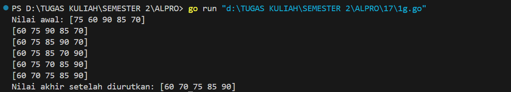
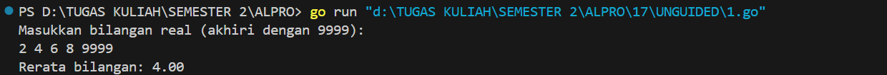
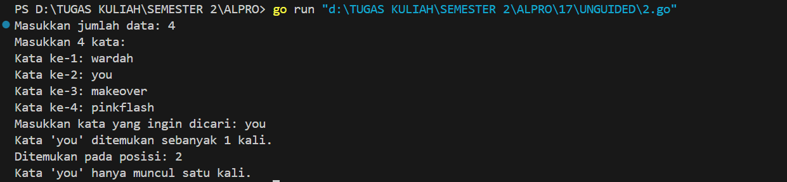
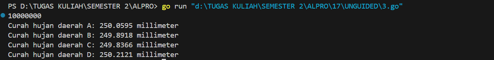
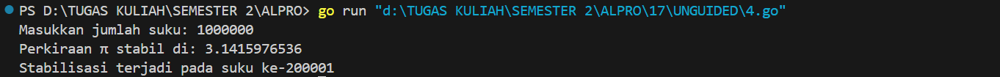
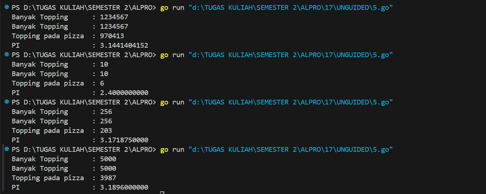

<h1 align="center">Laporan Praktikum Modul 17<br>Skema Pemrosesan Sekuensial</h1>
<p align="center">Azzahra Farelika Esti Ning Tyas - 103112430023</p>

## Dasar Teori

Skema pemrosesan sekuensial adalah cara memproses data secara berurutan dari awal hingga akhir, tanpa percabangan atau pengulangan. Setiap instruksi dijalankan satu per satu sesuai urutan, dan cocok untuk tugas-tugas sederhana seperti menghitung, menampilkan, atau mencari nilai.
## Guided

#### Soal 1

> Aldi memiliki daftar nilai ulangan matematika temannya: 75, 60, 90, 85, dan 70. Ia ingin mengurutkan nilai tersebut dari yang terkecil ke yang terbesar menggunakan metode Bubble Sort. Pertanyaan:
> 1. Tunjukkan proses pengurutan nilai menggunakan Bubble Sort hingga semua nilai terurut.
> 2. Berapa kali pertukaran (swap) terjadi dalam proses ini?

```go
package main

import (
	"fmt"
)

func main() {
	nilai := []int{75, 60, 90, 85, 70}

	fmt.Println("Nilai awal:", nilai)

	n := len(nilai)
	for i := 0; i < n-1; i++ {
		for j := 0; j < n-i-1; j++ {
			if nilai[j] > nilai[j+1] {
				nilai[j], nilai[j+1] = nilai[j+1], nilai[j]
				fmt.Println(nilai)
			}
		}
	}

	fmt.Println("Nilai akhir setelah diurutkan:", nilai)
}
```


Program Go ini mengurutkan slice angka menggunakan algoritma bubble sort. Program membandingkan dan menukar elemen yang lebih besar dengan yang lebih kecil secara berurutan hingga seluruh data terurut dari terkecil ke terbesar. Nilai awal, setiap perubahan saat proses sorting, dan hasil akhirnya ditampilkan ke layar.


## Unguided

#### Soal 1

> Diberikan sejumlah bilangan real yang diakhiri dengan marker 9999, cari rerata dari bilangan bilangan tersebut.

```go
package main

import (
	"fmt"
)

func main() {
	var (
		input   float64
		hasil   float64
		hitung  int
	)

	fmt.Println("Masukkan bilangan real (akhiri dengan 9999):")

	for {
		fmt.Scanln(&input)

		if input == 9999 {
			break
		}

		hasil += input
		hitung++
	}

	if hitung == 0 {
		fmt.Println("Tidak ada bilangan yang dimasukkan.")
	} else {
		rataRata := hasil / float64(hitung)
		fmt.Printf("Rerata bilangan: %.2f\n", rataRata)
	}
}
```


Program Go ini membaca sejumlah bilangan real yang dimasukkan pengguna satu per satu, dan proses input akan berhenti saat pengguna memasukkan angka 9999 sebagai tanda akhir. Setiap bilangan yang dimasukkan akan dijumlahkan ke variabel hasil, dan variabel hitung akan mencatat jumlah bilangan yang diterima. Setelah proses selesai, program akan menghitung dan menampilkan rata-rata dari bilangan yang dimasukkan. Jika tidak ada bilangan yang dimasukkan sebelum 9999, program akan menampilkan pesan bahwa tidak ada data yang diproses.

#### Soal 2

> Diberikan string x dan n buah string. x adalah data pertama yang dibaca, n adalah data bilangan yang dibaca kedua, dan n data berikutnya adalah data string. Buat algoritma untuk menjawab pertanyaan berikut:
> 1. Apakah string x ada dalam kumpulan n data string tersebut?
> 2. Pada posisi ke berapa string x tersebut ditemukan?
> 3. Ada berapakah string x dalam kumpulan n data string tersebut?
> 4. Adakah sedikitnya dua string x dalam n data string tersebut?

```go
package main

import (
	"fmt"
)

func main() {
	var n int
	fmt.Print("Masukkan jumlah data: ")
	fmt.Scanln(&n)

	data := make([]string, n)
	fmt.Println("Masukkan", n, "kata:")

	for i := 0; i < n; i++ {
		fmt.Printf("Kata ke-%d: ", i+1)
		fmt.Scanln(&data[i])
	}

	var target string
	fmt.Print("Masukkan kata yang ingin dicari: ")
	fmt.Scanln(&target)

	var posisi []int
	for i, v := range data {
		if v == target {
			posisi = append(posisi, i+1)
		}
	}

	jumlah := len(posisi)
	if jumlah == 0 {
		fmt.Println("Kata tidak ditemukan.")
	} else {
		fmt.Printf("Kata '%s' ditemukan sebanyak %d kali.\n", target, jumlah)
		fmt.Print("Ditemukan pada posisi: ")
		for i, p := range posisi {
			if i > 0 {
				fmt.Print(", ")
			}
			fmt.Print(p)
		}
		fmt.Println()

		if jumlah >= 2 {
			fmt.Printf("Kata '%s' muncul lebih dari satu kali.\n", target)
		} else {
			fmt.Printf("Kata '%s' hanya muncul satu kali.\n", target)
		}
	}
}
```


Program Go ini digunakan untuk mencari sebuah kata dalam sekumpulan data string yang dimasukkan oleh pengguna. Program meminta jumlah data, lalu menerima input berupa kata-kata dan menyimpannya dalam sebuah slice. Setelah itu, pengguna diminta memasukkan kata yang ingin dicari. Program kemudian memeriksa setiap elemen dalam slice dan mencatat posisi kemunculan kata yang dicari. Jika ditemukan, program menampilkan jumlah kemunculan dan posisi-posisinya. Jika tidak ditemukan, akan ditampilkan pesan bahwa kata tidak ada dalam data. Program juga memberikan informasi apakah kata tersebut muncul lebih dari satu kali atau hanya sekali.

#### Soal 3

> Empat daerah A, B, C, dan D yang berdekatan ingin mengukur curah hujan. Keempat daerah tersebut digambarkan pada bidang berikut: Misal curah hujan dihitung berdasarkan banyaknya tetesan air hujan. Setiap tetesan berukuran 0.0001 ml curah hujan. Tetesan air hujan turun secara acak dari titik (0,0) sampai (1,1). Jika diterima input yang menyatakan banyaknya tetesan air hujan. Tentukan curah hujan untuk keempat daerah tersebut. Buatlah program yang menerima input berupa banyaknya tetesan air hujan. Kemudian buat koordinat/titik (x, y) secara acak dengan menggunakan fungsi rand.Float64(). Hitung dan tampilkan banyaknya tetesan yang jatuh pada daerah A, B, C dan D. Konversikan satu tetesan berukuran 0.0001 milimeter.

```go
package main

import (
	"fmt"
	"math/rand"
	"time"
)

func main() {
	var n int
	fmt.Scan(&n)

	const volumeTetesan = 0.0001
	var curahA, curahB, curahC, curahD float64

	rand.Seed(time.Now().UnixNano())

	for i := 0; i < n; i++ {
		x := rand.Float64()
		y := rand.Float64()

		switch {
		case x < 0.5 && y < 0.5:
			curahA += volumeTetesan
		case x >= 0.5 && y < 0.5:
			curahB += volumeTetesan
		case x < 0.5 && y >= 0.5:
			curahC += volumeTetesan
		case x >= 0.5 && y >= 0.5:
			curahD += volumeTetesan
		}
	}

	fmt.Printf("Curah hujan daerah A: %.4f millimeter\n", curahA)
	fmt.Printf("Curah hujan daerah B: %.4f millimeter\n", curahB)
	fmt.Printf("Curah hujan daerah C: %.4f millimeter\n", curahC)
	fmt.Printf("Curah hujan daerah D: %.4f millimeter\n", curahD)
}
```


Program Go ini mensimulasikan curah hujan berdasarkan jumlah tetesan air yang dimasukkan pengguna. Setiap tetesan ditempatkan secara acak dalam bidang koordinat, lalu diklasifikasikan ke dalam salah satu dari empat daerah (A, B, C, D) berdasarkan nilai x dan y. Volume setiap tetesan adalah 0.0001 millimeter, dan total curah hujan di setiap daerah dihitung dengan menjumlahkan volume tetesan yang jatuh di wilayah tersebut. Hasil akhir berupa curah hujan untuk masing-masing daerah ditampilkan ke layar.

#### Soal 4

> Berdasarkan formula Leibniz, nilai π dapat dinyatakan sebagai deret harmonik ganti sebagai berikut: 1 − 1/3 + 1/5 − 1/7 + 1/9 − ⋯ = phi/4 Suku ke-i dinyatakan sebagai 𝑆𝑖 dan jumlah deret adalah 𝑆. Apabila diketahui suku pertama 𝑆1 = 1, suku kedua 𝑆2 = −1/3 . Temukan rumus untuk suku ke-𝒊 atau 𝑆𝑖 . Berdasarkan rumus tersebut, buatlah program yang menghitung 𝑆 untuk 1000000 suku pertama.

```go
package main

import (
	"fmt"
	"math"
)

func main() {
	var jumlah int
	fmt.Print("Masukkan jumlah suku: ")
	fmt.Scan(&jumlah)

	nilaiPi := 0.0
	piSebelumnya := 0.0

	for indeks := 0; indeks < jumlah; indeks++ {
		penyebut := float64(2*indeks + 1)
		kontribusi := 1.0 / penyebut

		if indeks%2 == 0 {
			nilaiPi += kontribusi
		} else {
			nilaiPi -= kontribusi
		}

		perkiraanPi := nilaiPi * 4
		selisih := math.Abs(perkiraanPi - piSebelumnya)

		if indeks > 0 && selisih < 0.00001 {
			fmt.Printf("Perkiraan π stabil di: %.10f\n", perkiraanPi)
			fmt.Printf("Stabilisasi terjadi pada suku ke-%d\n", indeks+1)
			break
		}

		piSebelumnya = perkiraanPi
	}
}
```


Program Go ini berfungsi untuk menghitung pendekatan nilai π (pi) menggunakan deret Leibniz, yaitu rumus π ≈ 4 × (1 - 1/3 + 1/5 - 1/7 + ...). Program meminta input jumlah suku dari pengguna, lalu menghitung nilai π secara bertahap dengan menambahkan atau mengurangkan pecahan berdasarkan indeks genap atau ganjil. Pada setiap iterasi, hasil perkiraan π dikalikan 4 dan dibandingkan dengan hasil sebelumnya untuk melihat apakah perubahannya sudah cukup kecil (kurang dari 0.00001). Jika ya, program menghentikan perhitungan dan mencetak nilai π saat itu beserta jumlah suku yang dibutuhkan untuk mencapai kestabilan.

#### Soal 5

> Monti bekerja pada sebuah kedai pizza, saking ramainya kedai tersebut membuat Monti tidak ada waktu untuk bersantai. Suatu ketika saat sedang menaburkan topping pada pizza yang diletakkan pada wadah berbentuk persegi, terpikirkan oleh Monti cara menghitung berapa banyak topping yang dia butuhkan, dan cara menghitung nilai 𝝅.

```go
package main

import (
	"fmt"
	"math/rand"
	"time"
)

func main() {
	var jumlahTitik int
	fmt.Print("Banyak Topping      : ")
	fmt.Scan(&jumlahTitik)

	rand.Seed(time.Now().UnixNano())
	masukLingkaran := 0

	for hitung := 1; hitung <= jumlahTitik; hitung++ {
		px := rand.Float64()*2 - 1 
		py := rand.Float64()*2 - 1 

		if px*px+py*py < 1.0 {
			masukLingkaran++
		}
	}

	estimasiPi := 4 * float64(masukLingkaran) / float64(jumlahTitik)

	fmt.Printf("Banyak Topping      : %d\n", jumlahTitik)
	fmt.Printf("Topping pada pizza  : %d\n", masukLingkaran)
	fmt.Printf("PI                  : %.10f\n", estimasiPi)
}
```


Program Go ini merupakan sistem untuk memperkirakan nilai π (pi) menggunakan simulasi penaburan topping secara acak pada bidang persegi. Program meminta input jumlah "topping" (titik acak) dari pengguna, lalu menghasilkan koordinat acak antara -1 dan 1 untuk setiap titik. Setiap titik diperiksa apakah jatuh di dalam lingkaran satuan. Jumlah titik yang berada di dalam lingkaran dihitung, lalu digunakan untuk memperkirakan nilai π. Hasil akhir ditampilkan dalam format yang rapi, menunjukkan jumlah total titik, berapa yang berada di dalam lingkaran, dan nilai π yang diperkirakan.