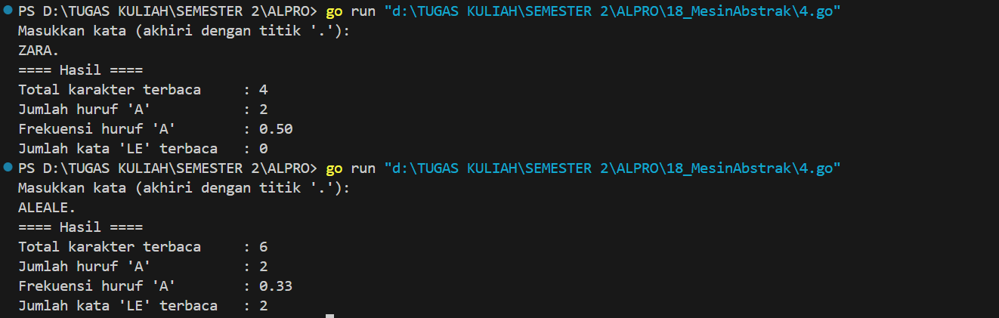

<h1 align="center">Laporan Praktikum Modul 18<br>Mesin Abstrak</h1>
<p align="center">Azzahra Farelika Esti Ning Tyas - 103112430023</p>

## Dasar Teori

Mesin abstrak adalah model komputasi yang dibangun berdasarkan model mesin yang sudah ada. Di dalamnya, tipe data dan operasi dasarnya dibuat dengan menggunakan tipe data dan operasi yang sudah tersedia di mesin sebelumnya. Teknik ini digunakan sebagai salah satu cara untuk membuat perangkat lunak.

#### Soal 4

> Implementasi mesin abstrak karakter yang bekerja terhadap untaian karakter (yang diakhiri dengan penanda titik (".") dan mempunyai sejumlah operasi dasar. 
> a. Operasi dasar mesin karakter: 
> ➢ Prosedur start(); yang menyiapkan mesin karakter di awal rangkaian karakter. 
> ➢ Prosedur maju(); yang memajukan pembaca ke posisi karakter berikutnya. 
> ➢ Fungsi eop(); yang mengembalikan nilai true apabila sudah mencapai akhir rangkaian, sampai ke penanda titik ("."). 
> ➢ Fungsi cc(); yang mengembalikan karakter yang sedang terbaca, atau berada pada posisi pembacaan mesin. 
> 
> b. Dengan operasi dasar di atas buat algoritma untuk: 
> ➢ Membaca seluruh karakter yang diberikan ke mesin karakter tersebut. 
> ➢ Menghitung berapa banyak karakter yang terbaca. 
> ➢ Menghitung ada berapa huruf "A" yang terbaca. 
> ➢ Menghitung frekuensi kemunculan huruf "A" terhadap seluruh karakter terbaca. 
> ➢ Menghitung ada berapa kata "LE" (pasangan berturutan huruf "L" dan "E") yang terbaca.

```go
package main

import (
	"fmt"
)

type MesinKarakter struct {
	input     string
	pos       int
	karakter  byte
}

func (m *MesinKarakter) start(input string) {
	m.input = input
	m.pos = 0
	if len(input) > 0 {
		m.karakter = input[0]
	} else {
		m.karakter = 0
	}
}

func (m *MesinKarakter) maju() {
	m.pos++
	if m.pos < len(m.input) {
		m.karakter = m.input[m.pos]
	} else {
		m.karakter = 0
	}
}

func (m *MesinKarakter) eop() bool {
	return m.karakter == '.'
}

func (m *MesinKarakter) cc() byte {
	return m.karakter
}

func main() {
	var input string
	fmt.Println("Masukkan kata (akhiri dengan titik '.'): ")
	fmt.Scanln(&input)

	m := MesinKarakter{}
	m.start(input)

	totalKarakter := 0
	jumlahA := 0
	jumlahLE := 0
	var prev byte = 0

	for !m.eop() {
		current := m.cc()

		if current != '.' {
			totalKarakter++
			if current == 'A' {
				jumlahA++
			}
			if prev == 'L' && current == 'E' {
				jumlahLE++
			}
			prev = current
		}

		m.maju()
	}

	var frekuensiA float64
	if totalKarakter > 0 {
		frekuensiA = float64(jumlahA) / float64(totalKarakter)
	}

	fmt.Println("==== Hasil ====")
	fmt.Println("Total karakter terbaca     :", totalKarakter)
	fmt.Println("Jumlah huruf 'A'           :", jumlahA)
	fmt.Printf("Frekuensi huruf 'A'        : %.2f\n", frekuensiA)
	fmt.Println("Jumlah kata 'LE' terbaca   :", jumlahLE)
}
```


Program Go ini adalah implementasi mesin abstrak karakter yang membaca untaian karakter hingga tanda titik ('.'). Program memiliki fungsi untuk memulai pembacaan (start), maju ke karakter berikutnya (maju), mengecek akhir pembacaan (eop), dan mengambil karakter saat ini (cc). Dalam fungsi main, program menghitung total karakter, jumlah huruf 'A', frekuensi huruf 'A', dan jumlah kemunculan pasangan huruf "LE", lalu menampilkan hasilnya.