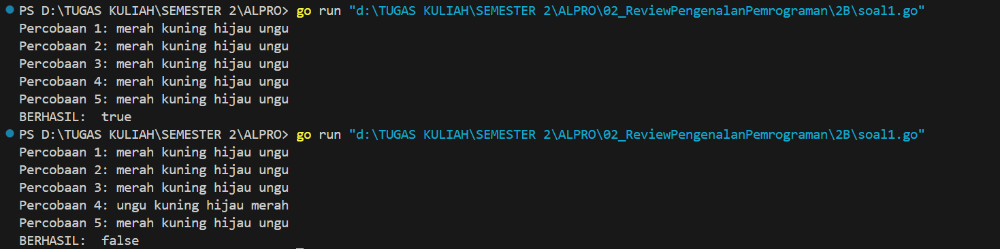
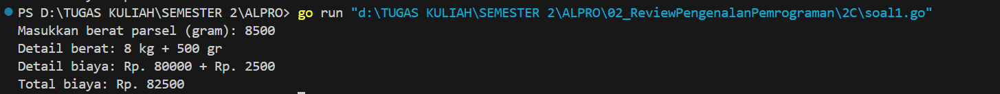

<h1 align="center">Laporan Praktikum Modul 2 <br>Review Pengenalan Pemrograman</h1>
<p align="center">Azzahra Farelika Esti Ning Tyas - 103112430023</p>

## Dasar Teori

Bahasa Go adalah bahasa pemrograman yang dikembangkan di Google. Go menyediakan tipe data cukup beragam, mulai dari bilangan bulat, bilangan desimal, nilai boolean, hingga string. Sedangkan untuk proses deklarasi variabel di Go juga terbilang fleksibel. Go memiliki perulangan menggunakan for, serta struktur pengambilan keputusan melalui if-else dan switch-case yang dapat disesuaikan sesuai kebutuhan.

## Unguided

### Soal Latihan 2A

#### Soal 1

> Telusuri program berikut dengan cara mengkompilasi dan mengeksekusi program. Silakan masukan data yang sesuai sebanyak yang diminta program. Perhatikan keluaran yang diperoleh. Coba terangkan apa sebenarnya yang dilakukan program tersebut?

```go
package main

import "fmt"

func main() {

    var (
        satu, dua, tiga string
        temp string
    )

    fmt.Print("Masukan input string: ")
    fmt.Scanln(&satu)
    fmt.Print("Masukan input string: ")
    fmt.Scanln(&dua)
    fmt.Print("Masukan input string: ")
    fmt.Scanln(&tiga)
    fmt.Println("Output awal = " + satu + " " + dua + " " + tiga)
    temp = satu
    satu = dua
    dua = tiga
    tiga = temp
    fmt.Println("Output akhir = " + satu + " " + dua + " " + tiga)

}
```


Program tersebut meminta pengguna memasukkan tiga string, lalu menampilkan ketiga string tersebut dalam urutan awal. Setelah itu, program menukar posisi string secara bergeser ke kiri, di mana string pertama berpindah ke posisi terakhir, string kedua ke posisi pertama, dan string ketiga ke posisi kedua. Hasil akhir ditampilkan setelah proses penukaran telaj selesai.

#### Soal 2

>Tahun kabisat adalah tahun yang habis dibagi 400 atau habis dibagi 4 tetapi tidak habis dibagi 100. Buatlah sebuah program yang menerima input sebuah bilangan bulat dan memeriksa apakah bilangan tersebut merupakan tahun kabisat (true) atau bukan (false).

```go
package main

import (
    "fmt"
)
  
func isLeapYear(year int) bool {
    if year%400 == 0 {
        return true
    } else if year%100 == 0 {
        return false
    } else if year%4 == 0 {
        return true
    }
    return false

}

func main() {
    var year int
    fmt.Print("Tahun: ")
    fmt.Scan(&year)

    if isLeapYear(year) {
        fmt.Println(year, "Kabisat: true")
    } else {
        fmt.Println(year, "Kabisat: false")
    }
}
```


Program tersebut berfungsi untuk mengecek apakah suatu tahun termasuk tahun kabisat atau bukan. Pengguna diminta memasukkan tahun, lalu program menggunakan fungsi isLeapYear() untuk menentukan apakah tahun tersebut memenuhi aturan kabisat, yaitu habis dibagi 400, atau habis dibagi 4 tapi tidak habis dibagi 100. Hasilnya ditampilkan sebagai "Kabisat: true" jika tahun kabisat, atau "Kabisat: false" jika bukan.

#### Soal 3

>Buat program Bola yang menerima input jari-jari suatu bola (bilangan bulat). Tampilkan Volume dan Luas kulit bola. 𝑣𝑜𝑙𝑢𝑚𝑒𝑏𝑜𝑙𝑎 = 4 3 𝜋𝑟 3 dan 𝑙𝑢𝑎𝑠𝑏𝑜𝑙𝑎 = 4𝜋𝑟 2 (π ≈ 3.1415926535).

```go
package main

import (
	"fmt"
	"math"
)

func main() {
	var r int
	const pi = 3.1415926535

	fmt.Print("Jejari: ")
	fmt.Scan(&r)

	volume := (4.0 / 3.0) * pi * math.Pow(float64(r), 3)

	luas := 4 * pi * math.Pow(float64(r), 2)

	fmt.Printf("Bola dengan jari-jari %d memiliki volume %.4f dan luas kulit %.4f\n", r, volume, luas)
}
```


Program tersebut menghitung volume dan luas permukaan bola berdasarkan jari-jari yang dimasukkan pengguna. Nilai jari jari dibaca dari input, lalu rumus volume dan luas permukaan bola dihitung menggunakan konstanta phi dan fungsi pangkat dari pustaka math. Hasil akhirnya menunjukkan volume dan luas dengan 4 angka di belakang koma.

#### Soal 4

>Dibaca nilai temperatur dalam derajat Celsius. Nyatakan temperatur tersebut dalam Fahrenheit 𝐶𝑒𝑙𝑠𝑖𝑢𝑠 = (𝐹𝑎ℎ𝑟𝑒𝑛ℎ𝑒𝑖𝑡 − 32) × 5/9 𝑅𝑒𝑎𝑚𝑢𝑟 = 𝐶𝑒𝑙𝑐𝑖𝑢𝑠 × 4/5 𝐾𝑒𝑙𝑣𝑖𝑛 = (𝐹𝑎ℎ𝑟𝑒𝑛ℎ𝑒𝑖𝑡 + 459.67) × 5/9

```go
package main

import (
	"fmt"
)

func main() {
	var celsius float64

	fmt.Print("temperatur Celsius: ")
	fmt.Scan(&celsius)

	reamur := celsius * 4 / 5
	fahrenheit := (celsius * 9 / 5) + 32
	kelvin := celsius + 273

	fmt.Println("Derajat Reamur: ", reamur)
	fmt.Println("Derajat Fahrenheit: ", fahrenheit)
	fmt.Println("Derajat Kelvin: ", kelvin)
}
```


Program tersebut berfungsi mengkonversi suhu dari Celsius ke Reamur, Fahrenheit, dan Kelvin. Pengguna diminta memasukkan suhu dalam Celsius, kemudian program menghitung dan menampilkan hasil konversi ke tiga skala suhu lainnya menggunakan rumus konversi yang sesuai.

#### Soal 5

>Tipe karakter sebenarnya hanya apa yang tampak dalam tampilan. Di dalamnya tersimpan dalam bentuk biner 8 bit (byte) atau 32 bit (rune) saja. Buat program ASCII yang akan membaca 5 buat data integer dan mencetaknya dalam format karakter. Kemudian membaca 3 buah data karakter dan mencetak 3 buah karakter setelah karakter tersebut (menurut tabel ASCII) Masukan terdiri dari dua baris. Baris pertama berisi 5 buah data integer. Data integer mempunyai nilai antara 32 s.d. 127. Baris kedua berisi 3 buah karakter yang berdampingan satu dengan yang lain (tanpa dipisahkan spasi). Keluaran juga terdiri dari dua baris. Baris pertama berisi 5 buah representasi karakter dari data yang diberikan, yang berdampingan satu dengan lain, tanpa dipisahkan spasi. Baris kedua berisi 3 buah karakter (juga tidak dipisahkan oleh spasi).

```go
package main 

import "fmt"

func main() {
    var c1, c2, c3, c4, c5 byte
    var b1, b2, b3 byte

    fmt.Scan(&c1, &c2, &c3, &c4, &c5)
    fmt.Scanf("\n")
    fmt.Scanf("%c%c%c", &b1, &b2, &b3)

    fmt.Printf("%c%c%c%c%c\n", c1, c2, c3, c4, c5)
    fmt.Printf("%c%c%c", b1+1, b2+1, b3+1)
}
```


Program tersebut membaca lima karakter pertama dari inputan, kemudian membaca tiga karakter berikutnya setelah baris baru. Lima karakter pertama ditampilkan apa adanya, sedangkan tiga karakter berikutnya ditampilkan setelah masing-masing karakternya dinaikkan satu tingkat dalam kode ASCII. Program ini menunjukkan cara membaca karakter menggunakan tipe data byte di Go.

### Soal Latihan 2B

#### Soal 1

> Siswa kelas IPA di salah satu sekolah menengah atas di Indonesia sedang mengadakan praktikum kimia. Di setiap percobaan akan menggunakan 4 tabung reaksi, yang mana susunan warna cairan di setiap tabung akan menentukan hasil percobaan. Siswa diminta untuk mencatat hasil percobaan tersebut. Percobaan dikatakan berhasil apabila susunan warna zat cair pada gelas 1 hingga gelas 4 secara berturutan adalah ‘merah’, ‘kuning’, ‘hijau’, dan ‘ungu’ selama 5 kali percobaan berulang. Buatlah sebuah program yang menerima input berupa warna dari ke 4 gelas reaksi sebanyak 5 kali percobaan. Kemudian program akan menampilkan true apabila urutan warna sesuai dengan informasi yang diberikan pada paragraf sebelumnya, dan false untuk urutan warna lainnya.

```go
package main

import (
	"fmt"
)

func main() {
	var a, b, c, d string
	warna := true
	for i := 1; i <= 5; i++ {
		fmt.Printf("Percobaan %d: ", i)
		fmt.Scan(&a, &b, &c, &d)

		if a != "merah" || b != "kuning" || c != "hijau" || d != "ungu" {
			warna = false
		}
	}
	fmt.Println("BERHASIL: ", warna)
}
```


Program tersebut meminta pengguna memasukkan empat warna sebanyak lima kali. Setiap percobaan akan dicek apakah urutan warnanya adalah "merah", "kuning", "hijau", dan "ungu". Jika ada satu saja percobaan yang tidak sesuai urutan tersebut, hasil akhirnya akan mencetak BERHASIL: false, sedangkan jika semua percobaan benar, maka akan mencetak BERHASIL: true. Program ini menunjukkan cara melakukan input berulang, pengecekan kondisi, dan penggunaan variabel boolean di Go.

#### Soal 2

> Suatu pita (string) berisi kumpulan nama-nama bunga yang dipisahkan oleh spasi dan ‘– ‘, contoh pita diilustrasikan seperti berikut ini. Pita: mawar – melati – tulip – teratai – kamboja – anggrek Buatlah sebuah program yang menerima input sebuah bilangan bulat positif (dan tidak nol) N, kemudian program akan meminta input berupa nama bunga secara berulang sebanyak N kali dan nama tersebut disimpan ke dalam pita. (Petunjuk: gunakan operasi penggabungan string dengan operator “+” ). Tampilkan isi pita setelah proses input selesai.

```go
package main

import "fmt"

func main() {
	var bunga, pita string

	i := 0
	for selesai := false; !selesai; {
		i += 1
		fmt.Printf("Bunga %d: ", i)
		fmt.Scan(&bunga)
		if bunga != "SELESAI" {
			pita += bunga + "-"
		}
		selesai = bunga == "SELESAI"
	}
	fmt.Println("Pita: ", pita)
	fmt.Println("Bunga: ", i-1)
}
```


Program tersebut meminta pengguna memasukkan nama bunga satu per satu, lalu menyusun nama-nama bunga tersebut menjadi sebuah pita (string panjang yang berisi semua nama bunga dipisahkan tanda "-"). Proses berhenti saat pengguna mengetik "SELESAI". Di akhir, program menampilkan pita yang berisi daftar bunga serta jumlah bunga yang dimasukkan (tidak menghitung "SELESAI").

#### Soal 3

> Setiap hari Pak Andi membawa banyak barang belanjaan dari pasar dengan mengendarai sepeda motor. Barang belanjaan tersebut dibawa dalam kantong terpal di kiri-kanan motor. Sepeda motor tidak akan oleng jika selisih berat barang di kedua kantong sisi tidak lebih dari 9 kg. Buatlah program Pak Andi yang menerima input dua buah bilangan real positif yang menyatakan berat total masing-masing isi kantong terpal. Program akan terus meminta input bilangan tersebut hingga salah satu kantong terpal berisi 9 kg atau lebih.

```go
package main

import (
	"fmt"
)

func main() {
	for selesai := false; !selesai; {
		var a, b float64
		fmt.Print("Masukan berat belanjaan di kedua kantong: ")
		fmt.Scan(&a, &b)
		fmt.Println("Sepeda motor pak Andi akan oleng:", b-a >= 9)
		selesai = (a+b > 150) || (a < 0 || b < 0)
	}
	fmt.Println("Program selesai")
}
```


Program tersebut mengecek apakah sepeda motor Pak Andi oleng berdasarkan berat belanjaan di dua kantong. Setiap putaran, pengguna diminta memasukkan berat masing-masing kantong, lalu program akan memberi tahu apakah motor oleng, yaitu jika selisih berat kedua kantong minimal 9 kg. Program terus berjalan sampai total berat belanjaan melebihi 150 kg atau salah satu berat kantong bernilai negatif, lalu menampilkan pesan "Program selesai".

#### Soal 4
> Diberikan sebuah persamaan sebagai berikut ini. 𝑓(𝑘) = (4𝑘 + 2) 2 (4𝑘 + 1)(4𝑘 + 3) Buatlah sebuah program yang menerima input sebuah bilangan sebagai K, kemudian menghitung dan menampilkan nilai f(K) sesuai persamaan di atas.

```go
package main

import (
	"fmt"
)

func f(k int) float64 {
	numerator := float64((4*k + 2) * (4*k + 2))
	denominator := float64((4*k + 1) * (4*k + 3))
	return numerator / denominator
}

func approxSqrt2(K int) float64 {
	result := 1.0
	for k := 0; k < K; k++ {
		result *= f(k)
	}
	return result
}

func main() {
	var K int
	fmt.Scan(&K)

	sqrt2Approx := approxSqrt2(K)

	fmt.Printf("Nilai K = %d\n", K)
	fmt.Printf("Nilai akar 2 = %.10f\n", sqrt2Approx)
}
```


Program tersebut menghitung pendekatan nilai akar 2 menggunakan metode perkalian pecahan khusus berdasarkan nilai K yang dimasukkan pengguna. Fungsi f() menghitung pecahan sesuai rumus tertentu, lalu fungsi approxSqrt2() mengalikan semua pecahan tersebut dari k = 0 sampai K-1. Hasil akhirnya adalah perkiraan nilai akar 2 yang ditampilkan dengan presisi hingga 10 angka desimal. Semakin besar K, semakin mendekati akar 2 sebenarnya.

### Soal Latihan 2C

#### Soal 1

> PT POS membutuhkan aplikasi perhitungan biaya kirim berdasarkan berat parsel. Maka, buatlah program BiayaPos untuk menghitung biaya pengiriman tersebut dengan ketentuan sebagai berikut! Dari berat parsel (dalam gram), harus dihitung total berat dalam kg dan sisanya (dalam gram). Biaya jasa pengiriman adalah Rp. 10.000,- per kg. Jika sisa berat tidak kurang dari 500 gram, maka tambahan biaya kirim hanya Rp. 5,- per gram saja. Tetapi jika kurang dari 500 gram, maka tambahan biaya akan dibebankan sebesar Rp. 15,- per gram. Sisa berat (yang kurang dari 1kg) digratiskan biayanya apabila total berat ternyata lebih dari 10kg.

```go
package main

import (
	"fmt"
)

func main() {
	var beratGram int
	fmt.Print("Masukkan berat parsel (gram): ")
	fmt.Scan(&beratGram)

	beratKg := beratGram / 1000
	sisaGram := beratGram % 1000

	biayaKg := beratKg * 10000
	var biayaSisa int

	if beratKg > 10 {
		biayaSisa = 0
	} else {
		if sisaGram >= 500 {
			biayaSisa = sisaGram * 5
		} else {
			biayaSisa = sisaGram * 15
		}
	}

	totalBiaya := biayaKg + biayaSisa

	fmt.Printf("Detail berat: %d kg + %d gr\n", beratKg, sisaGram)
	fmt.Printf("Detail biaya: Rp. %d + Rp. %d\n", biayaKg, biayaSisa)
	fmt.Printf("Total biaya: Rp. %d\n", totalBiaya)
}
```


Program tersebut menghitung biaya pengiriman parsel berdasarkan berat yang dimasukkan pengguna dalam gram. Berat dikonversi ke kilogram dan gram sisa, lalu biaya dihitung berdasarkan tarif Rp 10.000 per kg. Jika berat lebih dari 10 kg, sisa gram tidak dikenakan biaya, tetapi jika kurang, sisa gram dihitung dengan tarif Rp 5 per gram untuk sisa di atas 500 gram, dan Rp 15 per gram untuk sisa di bawahnya. Akhirnya, program menampilkan rincian berat dan biaya, serta total biaya pengiriman.

#### Soal 2

> Jawablah pertanyaan-pertanyaan berikut: 
> a. Jika nam diberikan adalah 80.1, apa keluaran dari program tersebut? Apakah eksekusi program tersebut sesuai spesifikasi soal? 
> b. Apa saja kesalahan dari program tersebut? Mengapa demikian? Jelaskan alur program seharusnya! 
> c. Perbaiki program tersebut! Ujilah dengan masukan: 93.5; 70.6; dan 49.5. Seharusnya keluaran yang diperoleh adalah ‘A’, ‘B’, dan ‘D’.

##### Kode Awal
```go
package main
import “fmt”
func main() {
 var nam float64
 var nmk string
 fmt.Print(“Nilai akhir mata kuliah: “)
 fmt.Scanln(&nam)
 if nam > 80 {
 nam = “A”
 }
 if nam > 72.5 {
 nam = “AB”
 }
 if nam > 65 {
 nam = “B”
 }
 if nam > 57.5 {
 nam = “BC”
 }
 if nam > 50 {
 nam = “C”
 }
 if nam > 40 {
 nam = “D”
 } else if nam <= 40 {
 nam = “E”
 }
 fmt.Println(“Nilai mata kuliah: “, nmk)
}
```

##### Kode Setelah Perbaikan
```go
package main

import "fmt"

func main() {
	var nam float64
	var nmk string

	fmt.Print("Nilai akhir mata kuliah: ")
	fmt.Scan(&nam)

	if nam > 88 {
		nmk = "A"
	} else if nam > 72.5 {
		nmk = "AB"
	} else if nam > 65 {
		nmk = "B"
	} else if nam > 57.5 {
		nmk = "BC"
	} else if nam > 50 {
		nmk = "C"
	} else if nam > 40 {
		nmk = "D"
	} else {
		nmk = "E"
	}

	fmt.Println("Nilai mata kuliah: ", nmk)
}
```


Program tersebut berfungsi mengonversi nilai akhir mata kuliah menjadi nilai huruf (grade) berdasarkan rentang tertentu. Pengguna diminta memasukkan nilai akhir dalam bentuk angka desimal, kemudian program mengevaluasi nilai tersebut menggunakan kondisi if-else berjenjang. Hasil akhirnya ditampilkan sebagai nilai huruf, mulai dari A (tertinggi) hingga E (terendah).

#### Soal 3

> Sebuah bilangan bulat b memiliki faktor bilangan f > 0 jika f habis membagi b. Contoh: 2 merupakan faktor dari bilangan 6 karena 6 habis dibagi 2. Buatlah program yang menerima input sebuah bilangan bulat b dan b > 1. Program harus dapat mencari dan menampilkan semua faktor dari bilangan tersebut!
> Bilangan bulat b > 0 merupakan bilangan prima p jika dan hanya jika memiliki persis dua faktor bilangan saja, yaitu 1 dan dirinya sendiri. Lanjutkan program sebelumnya. Setelah menerima masukan sebuah bilangan bulat b > 0. Program tersebut mencari dan menampilkan semua faktor bilangan tersebut. Kemudian, program menentukan apakah b merupakan bilangan prima.

```go
package main

import (
	"fmt"
)

func main() {
	var b int
	fmt.Print("Bilangan: ")
	fmt.Scan(&b)

	if b <= 0 {
		fmt.Println("Bilangan harus lebih besar dari 0!")
		return
	}

	fmt.Print("Faktor: ")
	faktor := []int{}
	for i := 1; i <= b; i++ {
		if b%i == 0 {
			faktor = append(faktor, i)
			fmt.Print(i, " ")
		}
	}
	fmt.Println()

	isPrima := len(faktor) == 2 
	fmt.Println("Prima:", isPrima)
}
```


Program tersebut berfungsi untuk mengecek faktor-faktor dari sebuah bilangan positif sekaligus menentukan apakah bilangan tersebut adalah bilangan prima. Pengguna diminta memasukkan bilangan bulat positif, lalu program mencetak semua faktor bilangan tersebut. Setelah itu, program mengecek apakah jumlah faktornya tepat dua (hanya 1 dan bilangan itu sendiri), yang merupakan ciri bilangan prima. Jika iya, program mencetak "Prima: true", jika tidak maka "Prima: false".