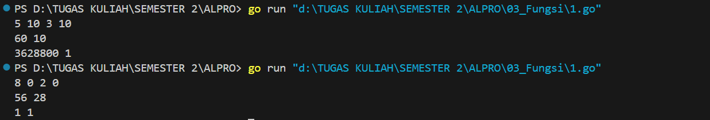
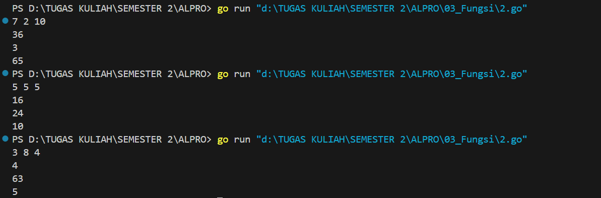
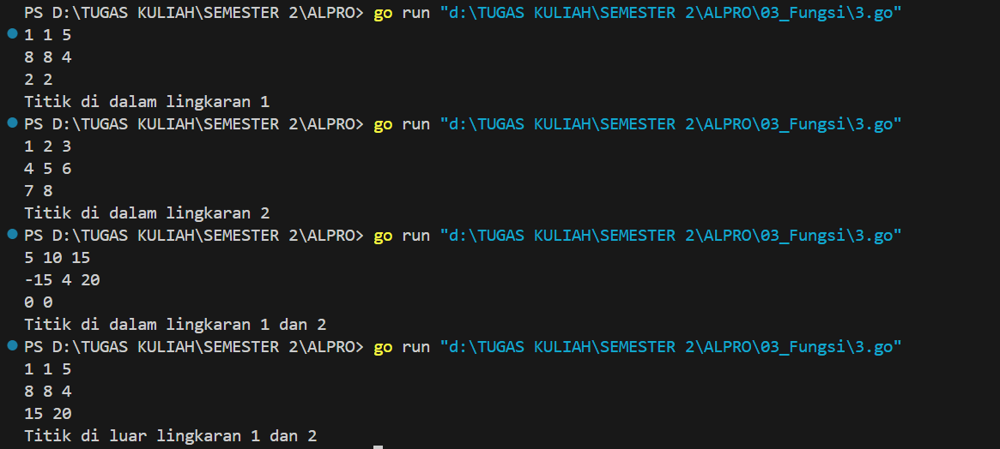

<h1 align="center">Laporan Praktikum Modul 3 <br>Fungsi</h1>
<p align="center">Azzahra Farelika Esti Ning Tyas - 103112430023</p>

## Dasar Teori

Fungsi dalam pemrograman adalah sekumpulan perintah untuk melakukan tugas tertentu dan menghasilkan suatu nilai sebagai hasilnya. Fungsi selalu mengembalikan nilai, sehingga sering digunakan untuk menghitung data. Agar bisa disebut fungsi, sebuah program harus memiliki tipe nilai yang dikembalikan dan menggunakan perintah return untuk mengembalikan hasilnya.
## Unguided

### Soal Latihan 2A

#### Soal 1

> Minggu ini, mahasiswa Fakultas Informatika mendapatkan tugas dari mata kuliah matematika diskrit untuk mempelajari kombinasi dan permutasi. Jonas salah seorang mahasiswa, iseng untuk mengimplementasikannya ke dalam suatu program. Oleh karena itu bersediakah kalian membantu Jonas? (tidak tentunya ya :p)
> 
> Masukan terdiri dari empat buah bilangan asli 𝑎, 𝑏, 𝑐, dan 𝑑 yang dipisahkan oleh spasi, dengan syarat 𝑎 ≥ 𝑐 dan 𝑏 ≥ 𝑑. 
> 
> Keluaran terdiri dari dua baris. Baris pertama adalah hasil permutasi dan kombinasi 𝒂 terhadap 𝑐, sedangkan baris kedua adalah hasil permutasi dan kombinasi 𝑏 terhadap 𝑑.

Catatan: permutasi (P) dan kombinasi (C) dari 𝑛 terhadap 𝑟 (𝑛 ≥ 𝑟) dapat dihitung dengan menggunakan persamaan berikut! 𝑃(𝑛, 𝑟) = 𝑛! (𝑛−𝑟)! , sedangkan 𝐶(𝑛, 𝑟) = 𝑛! 𝑟!(𝑛−𝑟)!

```go
package main

import (
	"fmt"
)

func faktorial(n int) int {
	if n == 0 || n == 1 {
		return 1
	}
	hasil := 1
	for i := 2; i <= n; i++ {
		hasil *= i
	}
	return hasil
}

func permutasi(n, r int) int {
	return faktorial(n) / faktorial(n-r)
}

func kombinasi(n, r int) int {
	return faktorial(n) / (faktorial(r) * faktorial(n-r))
}

func main() {
	var a, b, c, d int
	fmt.Scan(&a, &b, &c, &d)

	permA := permutasi(a, c)
	kombA := kombinasi(a, c)
	permB := permutasi(b, d)
	kombB := kombinasi(b, d)

	fmt.Println(permA, kombA)
	fmt.Println(permB, kombB)
}
```


Program tersebut digunakan untuk menghitung permutasi dan kombinasi dari dua pasang bilangan. Fungsi faktorial(n int) int menghitung faktorial dari suatu bilangan dengan menggunakan perulangan. Fungsi permutasi(n, r int) int dan kombinasi(n, r int) int kemudian menggunakan faktorial untuk menghitung nilai permutasi (P(n,r)=n!/(n−r)!P(n, r) = n! / (n-r)!P(n,r)=n!/(n−r)!) dan kombinasi (C(n,r)=n!/(r!(n−r)!)C(n, r) = n! / (r!(n-r)!)C(n,r)=n!/(r!(n−r)!)).

Dalam fungsi main(), program membaca empat bilangan bulat dari input dan menghitung permutasi serta kombinasi untuk dua pasangan bilangan tersebut. Hasilnya dicetak dalam dua baris, masing-masing berisi nilai permutasi dan kombinasi yang dihitung.

#### Soal 2

>Diberikan tiga buah fungsi matematika yaitu 𝑓 (𝑥) = 𝑥2 , 𝑔 (𝑥) = 𝑥 - 2 dan ℎ (𝑥) = 𝑥 + Fungsi komposisi (𝑓𝑜𝑔𝑜ℎ)(𝑥) artinya adalah 𝑓(𝑔(ℎ(𝑥))). Tuliskan 𝑓(𝑥), 𝑔(𝑥) dan ℎ(𝑥) dalam bentuk function. 
>
>Masukan terdiri dari sebuah bilangan bulat 𝑎, 𝑏 dan 𝑐 yang dipisahkan oleh spasi. 
>
>Keluaran terdiri dari tiga baris. Baris pertama adalah (𝑓𝑜𝑔𝑜ℎ)(𝑎), baris kedua (𝑔𝑜ℎ𝑜𝑓)(𝑏), dan baris ketiga adalah (ℎ𝑜𝑓𝑜𝑔)(𝑐)!

```go
package main

import (
	"fmt"
)

func f(x int) int {
	return x * x
}

func g(x int) int {
	return x - 2
}

func h(x int) int {
	return x + 1
}

func fogoh(x int) int {
	return f(g(h(x)))
}

func gohof(x int) int {
	return g(h(f(x)))
}

func hofog(x int) int {
	return h(f(g(x)))
}

func main() {
	var a, b, c int
	fmt.Scan(&a, &b, &c)

	fmt.Println(fogoh(a))
	fmt.Println(gohof(b))
	fmt.Println(hofog(c))
}
```


Program tersebut digunakan untuk menghitung komposisi fungsi matematika menggunakan tiga fungsi dasar: f(x) = x^2, g(x) = x - 2, dan h(x) = x + 1. Program ini mendefinisikan tiga fungsi komposisi: fogoh(x)`, `gohof(x), dan hofog(x), yang menampilkan hasil dari menerapkan fungsi fungsi tersebut secara berurutan. Fungsi fogoh(x) menghitung f(g(h(x)))f(g(h(x)))f(g(h(x))), gohof(x) menghitung g(h(f(x)))g(h(f(x)))g(h(f(x))), dan hofog(x) menghitung h(f(g(x)))h(f(g(x)))h(f(g(x))).

Dalam fungsi main(), program membaca tiga bilangan bulat sebagai input dan mencetak hasil dari masing-masing fungsi komposisi berdasarkan input tersebut
#### Soal 3

>Suatu lingkaran didefinisikan dengan koordinat titik pusat (𝑐𝑥, 𝑐𝑦) dengan radius 𝑟. Apabila diberikan dua buah lingkaran, maka tentukan posisi sebuah titik sembarang (𝑥, 𝑦) berdasarkan dua lingkaran tersebut.
>
>Masukan terdiri dari beberapa tiga baris. Baris pertama dan kedua adalah koordinat titik pusat dan radius dari lingkaran 1 dan lingkaran 2, sedangkan baris ketiga adalah koordinat titik sembarang. Asumsi sumbu x dan y dari semua titik dan juga radius direpresentasikan dengan bilangan bulat.
>
>Keluaran berupa string yang menyatakan posisi titik "Titik di dalam lingkaran 1 dan 2", "Titik di dalam lingkaran 1", "Titik di dalam lingkaran 2", atau "Titik di luar lingkaran 1 dan 2".

```go
package main

import (
	"fmt"
	"math"
)

func jarak(a, b, c, d float64) float64 {
	return math.Sqrt(math.Pow(a-c, 2) + math.Pow(b-d, 2))
}

func didalam(cx, cy, r, x, y float64) bool {
	return jarak(cx, cy, x, y) <= r
}

func main() {
	var cx1, cy1, r1, cx2, cy2, r2, x, y float64
	
	fmt.Scan(&cx1, &cy1, &r1)
	fmt.Scan(&cx2, &cy2, &r2)
	fmt.Scan(&x, &y)

	lingkaran1 := didalam(cx1, cy1, r1, x, y)
	lingkaran2 := didalam(cx2, cy2, r2, x, y)

	if lingkaran1 && lingkaran2 {
		fmt.Println("Titik di dalam lingkaran 1 dan 2")
	} else if lingkaran1 {
		fmt.Println("Titik di dalam lingkaran 1")
	} else if lingkaran2 {
		fmt.Println("Titik di dalam lingkaran 2")
	} else {
		fmt.Println("Titik di luar lingkaran 1 dan 2")
	}
}
```


Program tersebut digunakan untuk menentukan apakah sebuah titik berada di dalam satu atau dua lingkaran berdasarkan jarak dari pusat lingkaran. Fungsi jarak() menghitung jarak antara dua titik menggunakan rumus matematika. Fungsi didalam() memeriksa apakah titik tersebut berada dalam lingkaran dengan membandingkan jaraknya dengan jari-jari lingkaran. Program membaca input untuk dua lingkaran dan satu titik, lalu mengecek apakah titik itu berada di dalam salah satu atau kedua lingkaran, kemudian mencetak hasilnya.