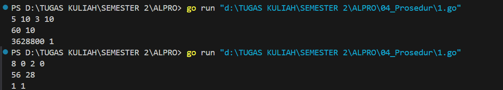
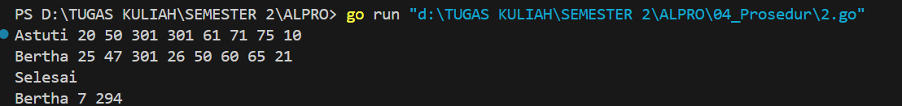
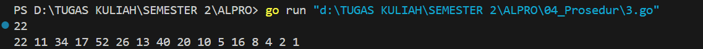

<h1 align="center">Laporan Praktikum Modul 4 <br>Prosedur</h1>
<p align="center">Azzahra Farelika Esti Ning Tyas - 103112430023</p>

## Dasar Teori

Prosedur adalah sebuah blok kode dalam pemrograman yang dirancang untuk menjalankan instruksi tertentu secara berulang atau sesuai kebutuhan. Pada intinya, prosedur itu memudahkan kita supaya tidak menuliskan ulang kode yang sama berkali-kali. Cukup buat sekali, lalu panggil kapan saja saat diperlukan. Prosedur membuat program jauh lebih rapi, lebih mudah dibaca, dan gampang dikelola.
## Unguided

#### Soal 1

> Minggu ini, mahasiswa Fakultas Informatika mendapatkan tugas dari mata kuliah matematika diskrit untuk mempelajari kombinasi dan permutasi. Jonas salah seorang mahasiswa, iseng untuk mengimplementasikannya ke dalam suatu program. Oleh karena itu bersediakah kalian membantu Jonas? (tidak tentunya ya :p)
> 
> Masukan terdiri dari empat buah bilangan asli 𝑎, 𝑏, 𝑐, dan 𝑑 yang dipisahkan oleh spasi, dengan syarat 𝑎 ≥ 𝑐 dan 𝑏 ≥ 𝑑.
> 
> Keluaran terdiri dari dua baris. Baris pertama adalah hasil permutasi dan kombinasi 𝒂 terhadap 𝑐, sedangkan baris kedua adalah hasil permutasi dan kombinasi 𝑏 terhadap 𝑑.

Catatan: permutasi (P) dan kombinasi (C) dari 𝑛 terhadap 𝑟 (𝑛 ≥ 𝑟) dapat dihitung dengan menggunakan persamaan berikut! 
𝑃(𝑛, 𝑟) = 𝑛! / (𝑛−𝑟)! , sedangkan 𝐶(𝑛, 𝑟) = 𝑛! / 𝑟!(𝑛𝑛−! 𝑟)!

```go
package main

import (
	"fmt"
)

func faktorial(n int) int {
	if n == 0 || n == 1 {
		return 1
	}
	result := 1
	for i := 2; i <= n; i++ {
		result *= i
	}
	return result
}

func permutasi(n, r int) int {
	return faktorial(n) / faktorial(n-r)
}

func kombinasi(n, r int) int {
	return faktorial(n) / (faktorial(r) * faktorial(n-r))
}

func main() {
	var a, b, c, d int
	fmt.Scan(&a, &b, &c, &d)

	fmt.Println(permutasi(a, c), kombinasi(a, c))
	fmt.Println(permutasi(b, d), kombinasi(b, d))
}
```


Program tersebut berfungsi untuk menghitung permutasi dan kombinasi dari dua pasang angka yang diinputkan oleh pengguna. Program ini menggunakan tiga fungsi utama, yaitu faktorial, permutasi, dan kombinasi. Fungsi faktorial(n int) int digunakan untuk menghitung nilai faktorial dari bilangan n. Kemudian, fungsi permutasi(n, r int) int memanfaatkan fungsi faktorial untuk menghitung nilai permutasi. Fungsi kombinasi(n, r int) int juga menggunakan fungsi faktorial untuk menghitung nilai kombinasi. 

Di dalam fungsi main, program meminta input empat bilangan bulat, yaitu a, b, c, dan d. Selanjutnya, program akan menampilkan hasil permutasi dan kombinasi untuk pasangan (a, c) dan (b, d).

#### Soal 2

>Kompetisi pemrograman tingkat nasional berlangsung ketat. Setiap peserta diberikan 8 soal yang harus dapat diselesaikan dalam waktu 5 jam saja. Peserta yang berhasil menyelesaikan soal paling banyak dalam waktu paling singkat adalah pemenangnya. 
>
>Buat program gema yang mencari pemenang dari daftar peserta yang diberikan. Program harus dibuat modular, yaitu dengan membuat prosedur hitungSkor yang mengembalikan total soal dan total skor yang dikerjakan oleh seorang peserta, melalui parameter formal. Pembacaan nama peserta dilakukan di program utama, sedangkan waktu pengerjaan dibaca di dalam prosedur. 
>
>`prosedure hitungSkor(in/out soal, skor : integer)`
>
>Setiap baris masukan dimulai dengan satu string nama peserta tersebut diikuti dengan adalah 8 integer yang menyatakan berapa lama (dalam menit) peserta tersebut menyelesaikan soal. Jika tidak berhasil atau tidak mengirimkan jawaban maka otomatis dianggap menyelesaikan dalam waktu 5 jam 1 menit (301 menit).
>
>Satu baris keluaran berisi nama pemenang, jumlah soal yang diselesaikan, dan nilai yang diperoleh. Nilai adalah total waktu yang dibutuhkan untuk menyelesaikan soal yang berhasil diselesaikan.

```go
package main

import "fmt"

func hitungSkor(soal, skor *int) {
	var time int

	*soal = 0
	*skor = 0
	
	for i := 0; i < 8; i++ {
		fmt.Scan(&time)
		if time < 301 {
			*soal++
			*skor += time
		}
	}
}

func main() {

	var nama, pemenang string
	var soal, skor, maksimumSoal, minimumSkor int

	maksimumSoal = -1
	minimumSkor = 99999

	for {
		fmt.Scan(&nama)

		if nama == "Selesai" || nama == "selesai" {
			break
		}

		hitungSkor(&soal, &skor)

		if soal > maksimumSoal || (soal == maksimumSoal && skor < minimumSkor) {
			maksimumSoal = soal
			minimumSkor = skor
			pemenang = nama
		}
	}

	fmt.Println(pemenang, maksimumSoal, minimumSkor)
}
```


Program tersebut berfungsi untuk mencari pemenang dari sebuah kompetisi pemrograman berdasarkan jumlah soal yang berhasil diselesaikan dan waktu penyelesaian tercepat. Fungsi hitungSkor menghitung jumlah soal yang diselesaikan dalam waktu kurang dari 301 menit dan menjumlahkan waktunya.

Di fungsi main, nama peserta diinput hingga "Selesai" atau "selesai" diketik. Setelah setiap input nama, fungsi hitungSkor dipanggil untuk menghitung skor peserta. Pemenang ditentukan berdasarkan jumlah soal terbanyak, atau jika sama, waktu penyelesaian terkecil. Program kemudian mencetak nama pemenang, jumlah soal yang diselesaikan, dan total waktu tercepat.
#### Soal 3

>Skiena dan Revilla dalam Programming Challenges mendefinisikan sebuah deret bilangan. Deret dimulai dengan sebuah bilangan bulat n. Jika bilangan n saat itu genap, maka suku berikutnya adalah ½n, tetapi jika ganjil maka suku berikutnya bernilai 3n+1. Rumus yang sama digunakan terus menerus untuk mencari suku berikutnya. Deret berakhir ketika suku terakhir bernilai 1.
>Sebagai contoh jika dimulai dengan n=22, maka deret bilangan yang diperoleh adalah:
>
>`22 11 34 17 52 26 13 40 20 10 5 16 8 4 2 1`
>
>Untuk suku awal sampai dengan 1000000, diketahui deret selalu mencapai suku dengan nilai
>1.
>
>Buat program skiena yang akan mencetak setiap suku dari deret yang dijelaskan di atas untuk
>nilai suku awal yang diberikan. Pencetakan deret harus dibuat dalam prosedur cetakDeret
>yang mempunyai 1 parameter formal, yaitu nilai dari suku awal.
>
>`prosedure cetakDeret(in n : integer )`
>
>Masukan berupa satu bilangan integer positif yang lebih kecil dari 1000000.
>
>Keluaran terdiri dari satu baris saja. Setiap suku dari deret tersebut dicetak dalam baris yang dan dipisahkan oleh sebuah spasi.

```go
package main

import "fmt"

func cetakDeret(n int) {
	for n != 1 {
		fmt.Printf("%d ", n)
		if n%2 == 0 {
			n /= 2
		} else {
			n = 3*n + 1
		}
	}
	fmt.Print("1\n")
}

func main() {
	var n int
	fmt.Scan(&n)
	cetakDeret(n)
}
```


Program tersebut berfungsi untuk mencetak deret bilangan. Fungsi cetakDeret(n int) menerima bilangan n sebagai input. Selama n tidak sama dengan 1, jika n genap, maka n dibagi 2 (n /= 2); jika ganjil, n dikalikan 3 dan ditambah 1 (n = 3xn + 1). Nilai n dicetak setiap langkah hingga mencapai 1, di mana program berhenti dan mencetak "1". 

Di fungsi main, nilai n diminta dari pengguna dan diteruskan ke fungsi cetakDeret.