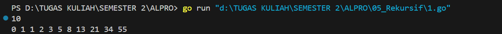
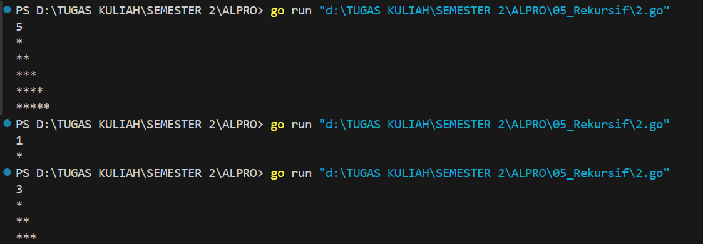
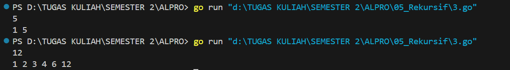
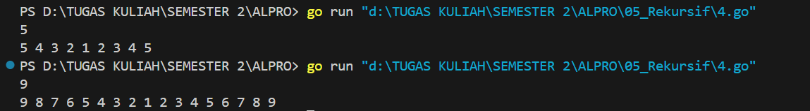
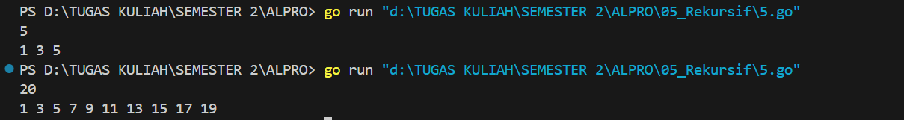
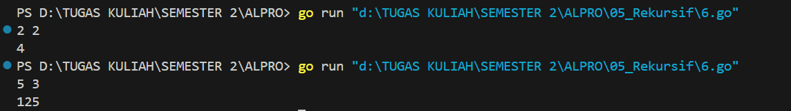

<h1 align="center">Laporan Praktikum Modul 5 <br>Rekursif</h1>
<p align="center">Azzahra Farelika Esti Ning Tyas - 103112430023</p>

## Dasar Teori

Rekursif adalah teknik dalam pemrograman di mana sebuah fungsi memanggil dirinya sendiri untuk menyelesaikan suatu tugas secara bertahap hingga mencapai kondisi akhir atau base case. Dengan rekursi, masalah yang kompleks dapat dipecah menjadi submasalah yang lebih kecil dan lebih sederhana. 
## Unguided

#### Soal 1

> Deret fibonacci adalah sebuah deret dengan nilai suku ke-0 dan ke-1 adalah 0 dan 1, dan nilai suku ke-n selanjutnya adalah hasil penjumlahan dua suku sebelumnya. Secara umum dapat diformulasikan 𝑆𝑛 = 𝑆𝑛-1 + 𝑆𝑛-2. Berikut ini adalah contoh nilai deret fibonacci hingga suku ke-10. Buatlah program yang mengimplementasikan fungsi rekursif pada deret fibonacci tersebut.

```go
package main

import "fmt"

func fibonacci(n int) int {
    if n == 0 {
        return 0
    } else if n == 1 {
        return 1
    }
    return fibonacci(n-1) + fibonacci(n-2)
}

func main() {
    var n int
    fmt.Scan(&n)
    for i := 0; i <= n; i++ {
        fmt.Print(fibonacci(i), " ")
    }
    fmt.Println()
}
```


Program tersebut berfungsi untuk menghitung dan menampilkan deret Fibonacci hingga angka ke-n yang diinputkan oleh pengguna. Program ini menggunakan fungsi rekursif fibonacci(n int) int untuk menghitung nilai Fibonacci dari bilangan n. Fungsi ini bekerja dengan basis kasus saat n == 0 mengembalikan 0 dan n == 1 mengembalikan 1, sementara untuk nilai lainnya dihitung dengan menjumlahkan hasil rekursif dari fibonacci(n-1) + fibonacci(n-2). 

Di dalam fungsi main, program meminta input sebuah bilangan bulat n dari pengguna. Kemudian, program akan mencetak deret Fibonacci dari indeks 0 hngga n dengan memanggil fungsi fibonacci(i) dalam perulangan.

#### Soal 2

>Buatlah sebuah program yang digunakan untuk menampilkan pola bintang berikut ini dengan menggunakan fungsi rekursif. N adalah masukan dari user.

```go
package main

import (
	"fmt"
)

func printStars(n int) {
    if n == 0 {
        return
    }
    fmt.Print("*")
    printStars(n - 1)
}

func printPattern(n, current int) {
    if current > n {
        return
    }
    printStars(current)
    fmt.Println()
    printPattern(n, current+1)
}

func main() {
    var n int
    fmt.Scan(&n)
    printPattern(n, 1)
}
```


Program tersebut berfungsi untuk mencetak pola segitiga bintang dengan jumlah baris sesuai dengan angka yang diinputkan oleh pengguna. Program ini menggunakan dua fungsi rekursif utama, yaitu printStars(n int) dan printPattern(n, current int).  

Fungsi printStars(n int) digunakan untuk mencetak n buah karakter bintang (*) dalam satu baris dengan cara rekursif. Jika n == 0, fungsi berhenti.  

Fungsi printPattern(n, current int) digunakan untuk mencetak pola segitiga secara bertahap. Fungsi ini akan mencetak current jumlah bintang dalam satu baris, lalu memanggil dirinya sendiri dengan current + 1, hingga mencapai nilai n.  

Di dalam fungsi main, program meminta input sebuah bilangan bulat n dari pengguna, lalu memanggil printPattern(n, 1) untuk mencetak pola bintang dari 1 hingga n baris.
#### Soal 3

>Buatlah program yang mengimplementasikan rekursif untuk menampilkan faktor bilangan dari suatu N, atau bilangan yang apa saja yang habis membagi N.  
>
>Masukan terdiri dari sebuah bilangan bulat positif N.  
>
>Keluaran terdiri dari barisan bilangan yang menjadi faktor dari N (terurut dari 1 hingga N ya).

```go
package main

import (
	"fmt"
)

func printFactors(n, divisor int) {
    if divisor > n {
        return
    }
    if n%divisor == 0 {
        fmt.Printf("%d ", divisor)
    }
    printFactors(n, divisor+1)
}

func main() {
    var n int
    fmt.Scan(&n)
    printFactors(n, 1)
    fmt.Println()
}
```


Program tersebut berfungsi untuk mencari dan mencetak semua faktor dari bilangan yang diinputkan oleh pengguna. Program ini menggunakan fungsi rekursif printFactors(n, divisor int) untuk mengecek dan mencetak faktor dari n.  

Fungsi printFactors(n, divisor int) bekerja dengan cara:  
1. Jika divisor lebih besar dari n, fungsi berhenti.  
2. Jika n habis dibagi divisor (n % divisor == 0), maka divisor dicetak sebagai salah satu faktor dari n.  
3. Fungsi kemudian memanggil dirinya sendiri dengan divisor + 1 untuk mengecek faktor berikutnya.  

Di dalam fungsi main, program meminta input sebuah bilangan bulat n dari pengguna, lalu memanggil printFactors(n, 1) untuk mencetak semua faktor n dari 1 hingga n.

#### Soal 4

> Buatlah program yang mengimplementasikan rekursif untuk menampilkan barisan bilangan tertentu.
>   
> Masukan terdiri dari sebuah bilangan bulat positif N.  
> 
> Keluaran terdiri dari barisan bilangan dari N hingga 1 dan kembali ke N.

```go
package main

import (
	"fmt"
)

func printDescending(n, current int) {
    if current == 0 {
        return
    }
    fmt.Printf("%d ", current)
    printDescending(n, current-1)
}

func printAscending(n, current int) {
    if current > n {
        return
    }
    fmt.Printf("%d ", current)
    printAscending(n, current+1)
}

func main() {
    var n int
    fmt.Scan(&n)
    
    printDescending(n, n)
    printAscending(n, 2)
    fmt.Println()
}
```


Program ini mencetak angka dari n ke 1, lalu dari 2 ke n menggunakan dua fungsi rekursif:  

* printDescending(n, current) mencetak angka menurun dari n ke 1.  
* printAscending(n, current) mencetak angka naik dari 2 ke n.  

Di main(), program membaca input n, lalu memanggil kedua fungsi untuk mencetak pola angka tanpa mengulang 1.

#### Soal 5

>Buatlah program yang mengimplementasikan rekursif untuk menampilkan barisan bilangan ganjil.
>
>Masukan terdiri dari sebuah bilangan bulat positif N.
>
>Keluaran terdiri dari barisan bilangan ganjil dari 1 hingga N.

```go
package main

import (
	"fmt"
)

func printOddNumbers(n, current int) {
    if current > n {
        return
    }
    fmt.Printf("%d ", current)
    printOddNumbers(n, current+2)
}

func main() {
    var n int
    fmt.Scan(&n)
    
    printOddNumbers(n, 1)
    fmt.Println()
}
```


Program ini mencetak bilangan ganjil dari 1 hingga n menggunakan fungsi rekursif:  

* printOddNumbers(n, current) mencetak angka current jika masih ≤ n, lalu memanggil dirinya sendiri dengan current + 2 untuk mencetak bilangan ganjil berikutnya.  

Di main(), program membaca input n lalu memanggil printOddNumbers(n, 1) untuk mencetak bilangan ganjil dari 1 hingga n.
#### Soal 6

>Buatlah program yang mengimplementasikan rekursif untuk mencari hasil pangkat dari dua buah bilangan.  
>
>Masukan terdiri dari bilangan bulat x dan y. 
>
>Keluaran terdiri dari hasil x dipangkatkan y.  
>
>Catatan: diperbolehkan menggunakan asterik "*", tapi dilarang menggunakan import "math"

```go
package main

import "fmt"

func power(x, y int) int {
    if y == 0 {
        return 1
    }
    return x * power(x, y-1)
}

func main() {
    var x, y int
    fmt.Scan(&x)
    fmt.Scan(&y)

    hasil := power(x, y)
    fmt.Print(hasil)
}
```


Program ini menghitung hasil pemangkatan x^y menggunakan rekursi:  

* power(x, y) mengembalikan 1 jika y == 0 (basis kasus), dan menghitung x * power(x, y-1) untuk kasus lainnya.  

Di main(), program membaca input x dan y, lalu memanggil power(x, y) untuk menghitung dan mencetak hasil pemangkatan.