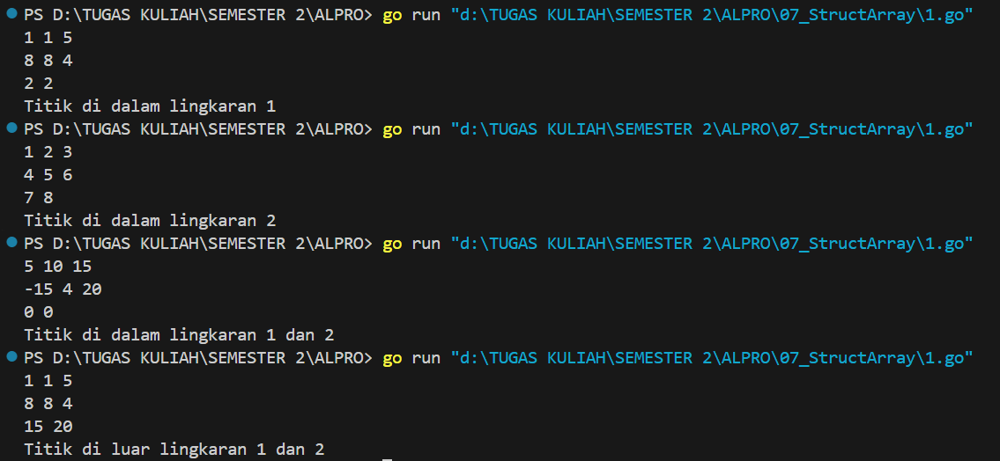

<h1 align="center">Laporan Praktikum Modul 7 <br>Struct Array</h1>
<p align="center">Azzahra Farelika Esti Ning Tyas - 103112430023</p>

## Dasar Teori

Struct Array adalah kombinasi antara struct dan array, di mana array berisi sekumpulan struct dengan struktur data yang sama. Dengan menggunakan Struct Array, data dapat disimpan dan dikelola secara lebih terstruktur serta efisien, terutama ketika bekerja dengan banyak elemen yang memiliki atribut yang sama. Cara ini sering digunakan dalam berbagai aplikasi untuk menyimpan dan memproses data yang kompleks dengan lebih sistematis.
## Unguided

#### Soal 1

> Suatu lingkaran didefinisikan dengan koordinat titik pusat (𝑐𝑥, 𝑐𝑦) dengan radius 𝑟. Apabila diberikan dua buah lingkaran, maka tentukan posisi sebuah titik sembarang (𝑥, 𝑦) berdasarkan dua lingkaran tersebut. Gunakan tipe bentukan titik untuk menyimpan koordinat, dan tipe bentukan lingkaran untuk menyimpan titik pusat lingkaran dan radiusnya.
> 
> Masukan terdiri dari beberapa tiga baris. Baris pertama dan kedua adalah koordinat titik pusat dan radius dari lingkaran 1 dan lingkaran 2, sedangkan baris ketiga adalah koordinat titik sembarang. Asumsi sumbu x dan y dari semua titik dan juga radius direpresentasikan dengan bilangan bulat.
> 
> Keluaran berupa string yang menyatakan posisi titik "Titik di dalam lingkaran 1 dan 2", "Titik di dalam lingkaran 1", "Titik di dalam lingkaran 2", atau "Titik di luar lingkaran 1 dan 2".

```go
package main

import (
	"fmt"
	"math"
)

type Titik struct {
	x, y int
}

type Lingkaran struct {
	pusat  Titik
	radius int
}

func jarak(p, q Titik) float64 {
	return math.Sqrt(float64((p.x-q.x)*(p.x-q.x) + (p.y-q.y)*(p.y-q.y)))
}

func didalam(c Lingkaran, p Titik) bool {
	return jarak(c.pusat, p) <= float64(c.radius)
}

func main() {
	var lingkaran [2]Lingkaran
	var p Titik

	for i := 0; i < 2; i++ {
		fmt.Scan(&lingkaran[i].pusat.x, &lingkaran[i].pusat.y, &lingkaran[i].radius)
	}

	fmt.Scan(&p.x, &p.y)

	inC1 := didalam(lingkaran[0], p)
	inC2 := didalam(lingkaran[1], p)

	if inC1 && inC2 {
		fmt.Println("Titik di dalam lingkaran 1 dan 2")
	} else if inC1 {
		fmt.Println("Titik di dalam lingkaran 1")
	} else if inC2 {
		fmt.Println("Titik di dalam lingkaran 2")
	} else {
		fmt.Println("Titik di luar lingkaran 1 dan 2")
	}
}
```


Program tersebut berfungsi untuk menentukan apakah suatu titik berada di dalam satu atau dua lingkaran. Pertama, program membaca input untuk dua lingkaran (pusat dan jari-jari) serta satu titik yang akan diperiksa. Dengan menggunakan rumus jarak, program menghitung apakah titik tersebut berada dalam jangkauan salah satu atau kedua lingkaran. Jika titik berada di dalam kedua lingkaran, program mencetak "Titik di dalam lingkaran 1 dan 2". Jika hanya di salah satu, akan ditampilkan lingkaran mana yang mencakup titik tersebut. Jika titik tidak masuk ke dalam keduanya, program mencetak "Titik di luar lingkaran 1 dan 2".

#### Soal 2

>Sebuah array digunakan untuk menampung sekumpulan bilangan bulat. Buatlah program bahasa go yang digunakan untuk mengisi array tersebut sebanyak N elemen nilai. Asumsikan array memiliki kapasitas penyimpanan data sejumlah elemen tertentu. Program dapat menampilkan beberapa informasi berikut: 
>a. Menampilkan keseluruhan isi dari array. 
>b. Menampilkan elemen-elemen array dengan indeks ganjil saja. 
>c. Menampilkan elemen-elemen array dengan indeks genap saja (asumsi indek ke-0 adalah genap). 
>d. Menampilkan elemen-elemen array dengan indeks kelipatan bilangan x. x bisa diperoleh dari masukan pengguna. 
>e. Menghapus elemen array pada indeks tertentu, asumsi indeks yang hapus selalu valid. Tampilkan keseluruhan isi dari arraynya, pastikan data yang dihapus tidak tampil 
>f. Menampilkan rata-rata dari bilangan yang ada di dalam array. 
>g. Menampilkan standar deviasi atau simpangan baku dari bilangan yang ada di dalam array tersebut. 
>h. Menampilkan frekuensi dari suatu bilangan tertentu di dalam array yang telah diisi tersebut.

```go
package main

import (
	"fmt"
	"math"
)

func mean(arr []int) float64 {
	if len(arr) == 0 {
		return 0 
	}
	sum := 0
	for _, v := range arr {
		sum += v
	}
	return float64(sum) / float64(len(arr))
}

func stdDev(arr []int) float64 {
	if len(arr) == 0 {
		return 0
	}
	m, sum := mean(arr), 0.0
	for _, v := range arr {
		sum += math.Pow(float64(v)-m, 2)
	}
	return math.Sqrt(sum / float64(len(arr)))
}

func main() {
	var n, x, delIdx, freqNum int
	fmt.Print("Masukkan jumlah elemen array: ")
	fmt.Scan(&n)

	if n <= 0 {
		fmt.Println("Jumlah elemen harus lebih dari 0!")
		return
	}

	arr := make([]int, n)
	fmt.Println("Masukkan elemen array:")
	for i := range arr {
		fmt.Scan(&arr[i])
	}

	fmt.Println("Isi array:", arr)

	fmt.Print("Indeks ganjil:")
	for i := 0; i < n; i += 2 {
		fmt.Print(" ", arr[i])
	}

	fmt.Println()
	fmt.Print("Indeks genap:")
	for i := 1; i < n; i += 2 {
		fmt.Print(" ", arr[i])
	}

	fmt.Println()
	fmt.Print("Masukkan kelipatan indeks yang ingin ditampilkan: ")
	fmt.Scan(&x)
	if x <= 0 {
		fmt.Println("Kelipatan harus lebih dari 0!")
		return
	}
	fmt.Print("Indeks kelipatan ", x, ":")
	for i := x - 1; i < n; i += x {
		fmt.Print(" ", arr[i])
	}

	fmt.Println()
	fmt.Print("Masukkan indeks (mulai dari 1) yang ingin dihapus: ")
	fmt.Scan(&delIdx)

	if delIdx < 1 || delIdx > len(arr) {
		fmt.Println("Indeks tidak valid!")
		return
	}

	delIdx-- 
	arr = append(arr[:delIdx], arr[delIdx+1:]...)
	if len(arr) == 0 {
		fmt.Println("Array kosong setelah penghapusan!")
		return
	}

	fmt.Println("Setelah hapus:", arr)
	fmt.Println("Rata-rata:", mean(arr))
	fmt.Println("Standar deviasi:", stdDev(arr))

	fmt.Print("Masukkan bilangan yang ingin dicari frekuensinya: ")
	fmt.Scan(&freqNum)
	count := 0
	for _, v := range arr {
		if v == freqNum {
			count++
		}
	}
	fmt.Println("Frekuensi", freqNum, ":", count)
}
```


Program tersebut berfungsi untuk mengolah array integer dengan berbagai operasi seperti menampilkan elemen berdasarkan indeks tertentu, menghitung rata-rata dan standar deviasi, menghapus elemen, serta mencari frekuensi suatu bilangan. Program diawali dengan meminta pengguna memasukkan jumlah elemen array (n), lalu mengisi array dengan nilai yang dimasukkan. Setelah itu, program menampilkan isi array dan membedakan elemen berdasarkan indeks ganjil, genap, serta kelipatan tertentu yang ditentukan oleh pengguna. Pengguna juga dapat menghapus elemen pada indeks tertentu dengan validasi agar indeks yang dimasukkan tidak di luar batas. Setelah penghapusan, program menghitung rata-rata dan standar deviasi dari elemen yang tersisa, dengan memastikan tidak ada pembagian dengan nol jika array menjadi kosong. Terakhir, program mencari dan menampilkan frekuensi suatu bilangan dalam array. Dengan berbagai validasi input yang diterapkan, program ini menjadi lebih stabil, aman, dan interaktif dalam menangani operasi array di bahasa Go.
#### Soal 3

>Sebuah program bahasa go digunakan untuk menyimpan dan menampilkan nama-nama klub yang memenangkan pertandingan bola pada suatu grup pertandingan. Buatlah program yang digunakan untuk merekap skor pertandingan bola 2 buah klub bola yang berlaga. Pertama-tama program meminta masukan nama-nama klub yang bertanding, kemudian program meminta masukan skor hasil pertandingan kedua klub tersebut. Yang disimpan dalam array adalah nama-nama klub yang menang saja. Proses input skor berhenti ketika skor salah satu atau kedua klub tidak valid (negatif). Di akhir program, tampilkan daftar klub yang memenangkan pertandingan.

```go
package main

import (
	"fmt"
)

func main() {
    var klubA, klubB string
    fmt.Print("Klub A: ")
    fmt.Scanln(&klubA)
    fmt.Print("Klub B: ")
    fmt.Scanln(&klubB)

    var skorA, skorB int
    var pemenang []string
    pertandingan := 1

    for {
        fmt.Printf("Pertandingan %d: ", pertandingan)
        _, err := fmt.Scan(&skorA, &skorB)

        if err != nil {
            fmt.Println("Input tidak valid! Harap masukkan angka.")
            continue
        }

        if skorA < 0 || skorB < 0 {
            fmt.Println("Pertandingan selesai.")
            break
        }

        if skorA > skorB {
            pemenang = append(pemenang, klubA)
        } else if skorB > skorA {
            pemenang = append(pemenang, klubB)
        } else {
            pemenang = append(pemenang, "Draw")
        }

        pertandingan++
    }

    fmt.Println("\nHasil Pertandingan:")
    for i, p := range pemenang {
        fmt.Printf("Hasil %d: %s\n", i+1, p)
    }
}
```


Program tersebut berfungsi untuk mencatat hasil pertandingan antara dua klub berdasarkan skor yang dimasukkan pengguna. Program dimulai dengan meminta nama kedua klub (klubA dan klubB), lalu memasuki perulangan di mana pengguna dapat memasukkan skor untuk setiap pertandingan secara berulang. Jika skor yang dimasukkan tidak valid (bukan angka), program akan menampilkan pesan kesalahan dan meminta input ulang. Jika salah satu skor yang dimasukkan negatif, program akan berhenti dan mencetak hasil pertandingan. Setiap pertandingan dicatat dalam slice pemenang, di mana jika skor klub A lebih besar, maka namanya disimpan; jika skor klub B lebih besar, maka namanya yang disimpan; dan jika skor sama, hasilnya dicatat sebagai "Draw". Setelah perulangan berakhir, program menampilkan daftar hasil dari setiap pertandingan yang telah dicatat. Program ini cukup interaktif dan menangani input dengan baik, sehingga memudahkan pengguna dalam mencatat dan melihat hasil pertandingan secara otomatis.

#### Soal 4

> Sebuah array digunakan untuk menampung sekumpulan karakter, Anda diminta untuk membuat sebuah subprogram untuk melakukan membalikkan urutan isi array dan memeriksa apakah membentuk palindrom.

```go
package main

import (
	"fmt"
)

const NMAX int = 127  

type tabel [NMAX]rune

func isiArray(t *tabel, n *int) {
    var ch rune
    *n = 0
    for {
        fmt.Scanf("%c", &ch)
        if ch == '.' || *n >= NMAX {
            break
        }
        t[*n] = ch
        (*n)++
    }
}

func cetakArray(t tabel, n int) {
    for i := 0; i < n; i++ {
        fmt.Printf("%c", t[i])
    }
    fmt.Println()
}

func balikanArray(t *tabel, n int) {
    for i, j := 0, n-1; i < j; i, j = i+1, j-1 {
        t[i], t[j] = t[j], t[i]
    }
}

func palindrom(t tabel, n int) bool {
    for i := 0; i < n/2; i++ {
        if t[i] != t[n-1-i] {
            return false
        }
    }
    return true
}

func main() {
    var tab tabel
    var m int
    fmt.Print("Teks: ")
    isiArray(&tab, &m)

    fmt.Print("Reverse teks: ")
    balikanArray(&tab, m)
    cetakArray(tab, m)

    fmt.Print("Palindrom? ")
    if palindrom(tab, m) {
        fmt.Println("true")
    } else {
        fmt.Println("false")
    }
}
```


Program tersebut berfungsi untuk membaca teks karakter per karakter hingga menemukan tanda titik (.), lalu membalik teks tersebut dan mengecek apakah teks tersebut merupakan palindrom. Program menggunakan array tabel dengan kapasitas maksimum 127 karakter untuk menyimpan input. Fungsi isiArray membaca karakter dari input dan menyimpannya dalam array hingga titik ditemukan. Fungsi cetakArray digunakan untuk mencetak isi array, sedangkan balikanArray membalik urutan karakter dalam array dengan metode pertukaran dua sisi (swap). Untuk mengecek apakah teks adalah palindrom, fungsi palindrom membandingkan karakter dari awal dan akhir, bergerak ke tengah. Jika semua pasangan karakter sesuai, teks dianggap palindrom. Dalam main, program membaca input, menampilkan versi terbaliknya, lalu mencetak apakah teks tersebut palindrom atau tidak. Jika input adalah "radar.", output menunjukkan bahwa teks adalah palindrom, sedangkan jika input "hello.", output menunjukkan bahwa teks bukan palindrom. Program ini efektif untuk memahami manipulasi array karakter secara manual di Go.